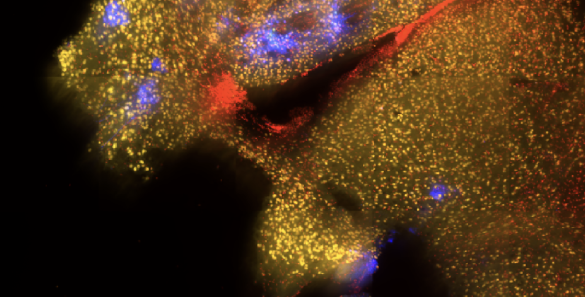

<p align="center">
  
</p>

<h1 align="center">FUS Controller</h1>

<p align="center">
  <b>Machine learning based acoustic feedback controller for FUS-BBB mediated AAV delivery</b><br>
  <sub>ES91r Independent Study &middot; Fall 2026 &middot; Todd Lab, Brigham and Women's Hospital / Harvard Medical School</sub>
</p>

---

## Overview

The blood-brain barrier (BBB) blocks most gene therapies — including adeno-associated viruses (AAVs) — from reaching the central nervous system. Focused ultrasound (FUS) combined with circulating microbubbles can open the BBB non-invasively and transiently, but the therapeutic window is narrow: too little acoustic energy and nothing is delivered, too much and tissue is damaged.

As microbubbles cavitate under FUS, they emit acoustic signatures that a piezoelectric receiver can pick up in real time. This project asks whether those emissions can be turned into a *dose* signal — a controller that predicts, and eventually regulates, how much AAV actually crosses into the brain.

This repository holds the computational half of that effort: signal processing of acoustic emission recordings, quantification of delivered AAV from fluorescence microscopy, and the models that connect the two.

## Approach

The work runs in three stages, each feeding the next.

**1. Feature extraction from acoustic emissions.** Raw time-series recordings from prior FUS experiments are imported, filtered, and transformed into the frequency domain. The goal is to isolate the emission bands that track BBB opening — harmonic (the second harmonic looks promising in preliminary work), subharmonic, ultraharmonic, and broadband.

**2. Ground truth from tissue.** In vivo FUS experiments in mouse models, followed by brain sectioning, staining, and fluorescence microscopy. Quantifying GFP-reporter signal in the sonicated region gives a physical measure of AAV delivered — the label the model learns against. The banner above is one such section.

**3. Mapping acoustics to delivery.** Acoustic features are aligned to their corresponding tissue measurements and used to train a baseline model that predicts delivery outcome from emissions alone. This is the first step toward a closed-loop controller that adjusts pressure mid-sonication.

## Repository layout

```
assets/        Figures and images used in documentation
Literature/    Reference papers on FUS-BBB opening, cavitation, and AAV delivery
IF_Data/       Immunofluorescence microscopy data (git-ignored — large binary .vsi/.ets)
notes/         Meeting notes and working log
projects/      Analysis code, final report drafts
reading/       Literature notes and summaries
reference/     Protocols and reference material
ARCH.md        Project charter: scope, weekly plan, deliverables
```

`IF_Data/` is excluded from version control — Olympus `.vsi` slide scans and their `.ets` tile stacks run to hundreds of megabytes per animal and live on lab storage instead.

## Data

| Source | Type | Notes |
|---|---|---|
| Acoustic emissions | Time-series, piezoelectric receiver | From prior Todd Lab FUS experiments; additional collection possible |
| Immunofluorescence | Whole-slide `.vsi` scans | Coronal sections, GFP reporter + nuclear counterstain |

Slide scans are read with [QuPath](https://qupath.github.io/); [ImageJ/Fiji](https://imagej.net/software/fiji/) works as an alternative for tile-level analysis.

## Stack

Python for the signal processing and modeling pipeline — NumPy/SciPy for spectral analysis, scikit-learn for the baseline models, matplotlib for figures. QuPath and ImageJ for whole-slide quantification.

## Deliverable

A written report in the form of a draft journal manuscript, covering the feature extraction methodology, the experimental protocol, and the predictive accuracy of the baseline model. If the model proves accurate and useful, it will be packaged for deployment in the Todd Lab's workflow.

See [`ARCH.md`](ARCH.md) for the full project charter and week-by-week plan.

## People

**Andrew Rodriguez** — student investigator
**Dr. Nicholas Todd** — principal investigator
**Dr. Bernie Owusu-Yaw** — primary mentor

## Background reading

Key references are kept in [`Literature/`](Literature/):

- Todd et al. — *Focused ultrasound for AAV delivery* (review), Molecular Therapy
- Owusu-Yaw et al. — *FUS-mediated AAV9 delivery in Huntington's disease*, Pharmaceutics, 2024
- Kofoed et al. — *AAV9 vs. AAV-PHP variants*, Molecular Therapy, 2021
- Thevenot et al. — *AAV delivery across the FUS-opened BBB*, Human Gene Therapy, 2012
- Aryal et al. — *Ultrasound-mediated BBB disruption for drug delivery* (review), Advanced Drug Delivery Reviews, 2014
