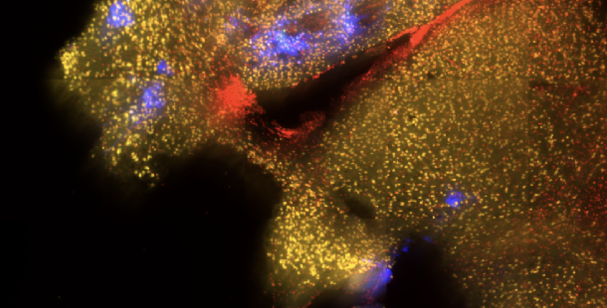
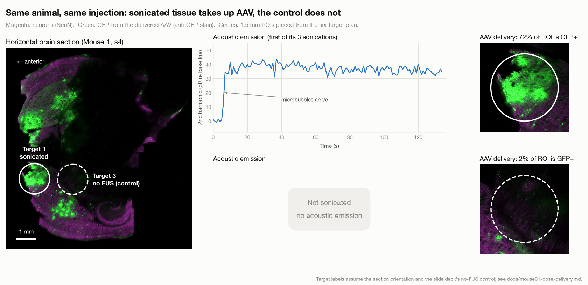
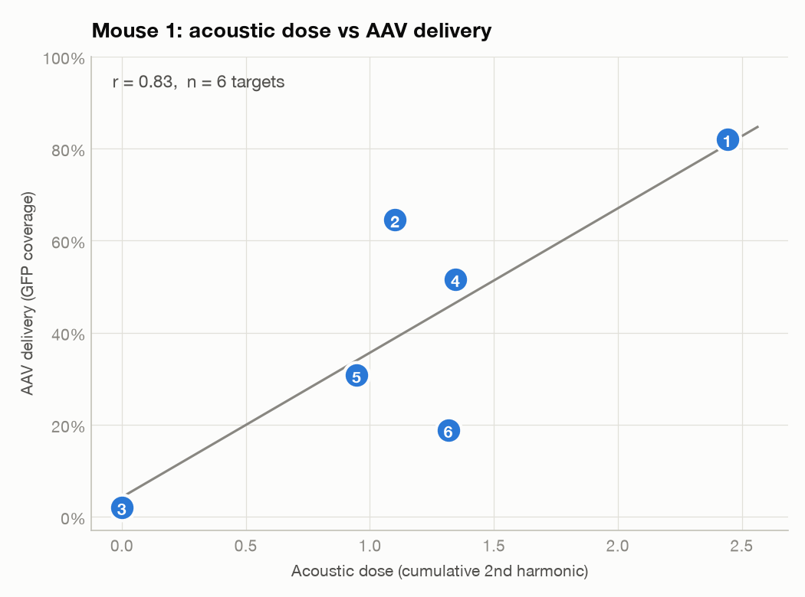
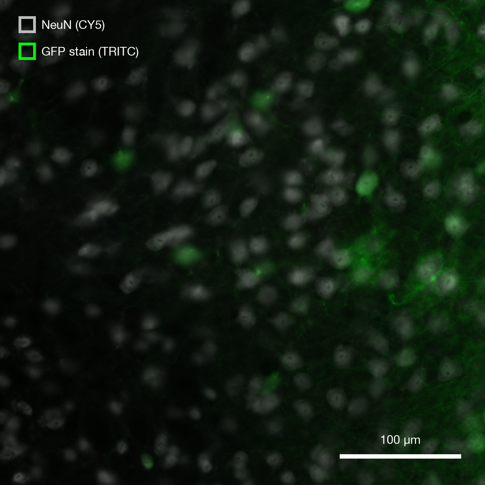
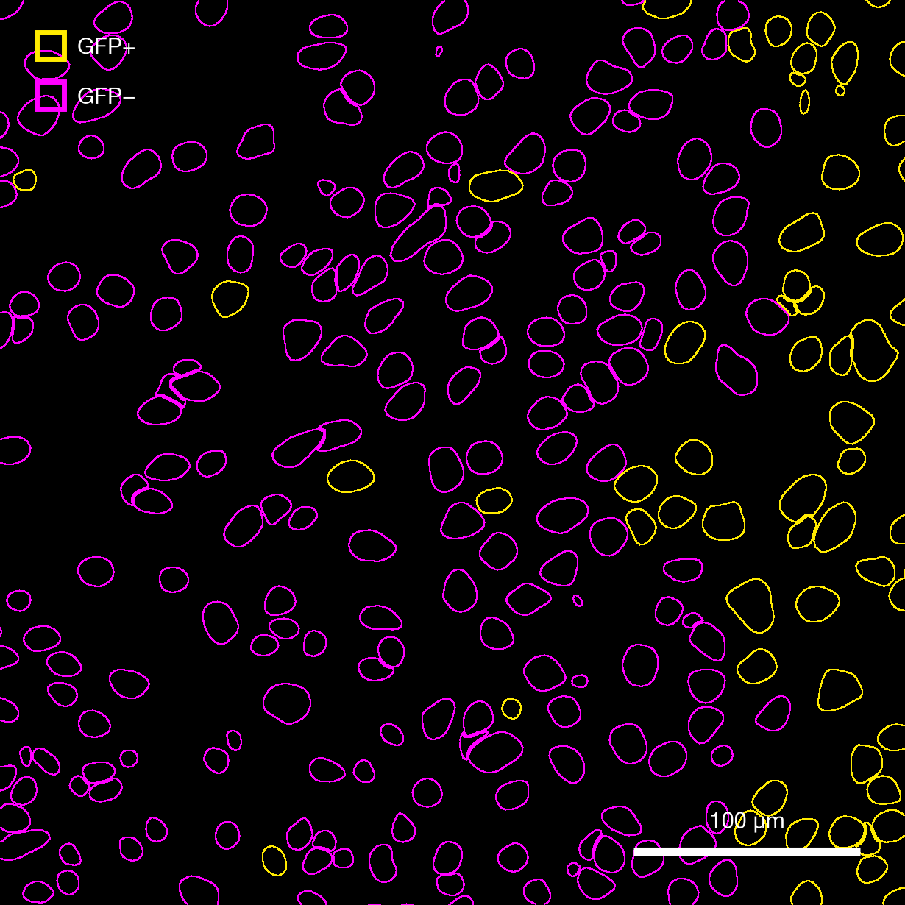

<p align="center">
  
</p>

<h1 align="center">FUS Controller</h1>

<p align="center">
  <b>Machine learning based acoustic feedback controller for FUS-BBB mediated AAV delivery</b><br>
  <sub>Research for Credit&middot; Fall 2026 &middot; Todd Lab, Brigham and Women's Hospital / Harvard Medical School</sub>
</p>

---

## Overview

The blood-brain barrier (BBB) blocks most gene therapies — including adeno-associated viruses (AAVs) — from reaching the central nervous system. Focused ultrasound (FUS) with circulating microbubbles opens it non-invasively and transiently, but the therapeutic window is narrow: too little acoustic energy and nothing is delivered, too much and tissue is damaged.

The lab already runs a closed-loop controller during sonication. It ramps drive voltage until the second-harmonic emission from cavitating microbubbles reaches a setpoint — the **harmonic goal** — an approach that traces back to Aryal et al. (2014). What that controller regulates, though, is an *acoustic* quantity. Nobody has yet shown how tightly it maps onto the quantity that actually matters: **how much AAV ends up in the brain**.

That gap is this project. The controller's prescribed dose (`N bursts × harmonic goal`) predicts the measured cumulative second-harmonic emission with r ≈ 0.76 — better than chance, far from deterministic. Skull geometry, vasculature, and microbubble kinetics fill in the rest. If acoustic emissions can be mapped to delivered AAV directly, the controller can be retargeted from an acoustic setpoint to a *delivery* setpoint.

This matters most for translation. Brute force is not an option in a patient: spending four or five minutes of sonication on every target is impractical, and longer exposure raises the risk of tissue damage. Knowing how much was delivered — rather than how much energy was applied — is what makes a shorter, safer exposure defensible.

## A real example: Mouse 1

<p align="center">
  
</p>

One mouse, one AAV injection, six planned targets. At **target 1** the controller drove the transducer while microbubbles circulated. The blue trace is the second-harmonic emission it regulates, about 40 dB above baseline once the bubbles arrive. **Target 3**, 2.5 mm behind it in the same brain, was left unsonicated as a control. In this section, 72% of the target 1 circle expresses GFP from the delivered virus; the control reads 2% (66% vs 2% averaged over four sections).

That is the whole premise: where the acoustic signal says the BBB opened, the virus got in. The open question — and the reason this project exists — is ***how much***. Plotting all six Mouse 1 targets, acoustic dose against delivery:

<p align="center">
  
</p>

The r = 0.85 comes almost entirely from the two ends: the unsonicated control, and target 1, which was sonicated three times. Among the four targets sonicated once (2, 4, 5 and 6), doses between 0.95 and 1.35 produced anywhere from 18% to 48% coverage, with no clear trend. That scatter is what a delivery-aware controller has to learn, and it takes more animals than one to learn it.

This is one animal. The recording-to-target mapping and the choice of GFP channel have since been confirmed with the lab; the full method, the remaining assumptions, and how each figure was made are in [`docs/mouse01-dose-delivery.md`](docs/mouse01-dose-delivery.md).

## Two animals, slice by slice

Mouse 2 is the first clean animal: each target was sonicated once, at six different doses. Its 12 sections are oriented by hand (front, notch side, and hand-finetuned target circles in napari) and measured the same way as Mouse 1's. Within each slice, the higher-dose targets tend to carry more GFP. Across the 11 slices with clear signal, the rank correlation of coverage with dose is positive in all 11 (median ρ = +0.54). Five Mouse 2 slices carry little GFP anywhere, probably cut outside the focal column, and they're reported separately. This is still two animals, so it's a consistent within-animal pattern, not a population result; the figures and caveats are in [`results/histology/slices/README.md`](results/histology/slices/README.md).

## From pixels to cells (pilot)

Coverage counts GFP+ *pixels*, most of which are processes rather than cell bodies. The pilot below asks how many *neurons* took up the virus. It segments every NeuN-stained cell with StarDist, scores each by its mean anti-GFP intensity (normalised over the whole section), and tags it GFP+ above a threshold. In a 3 × 3 mm square around one Mouse 2 target, 16,723 cells are segmented. Essentially every neuron within 0.5 mm of the target centre is tagged (97–100%), falling to under 1% beyond 1.25 mm.

<p align="center">
  
  
</p>

*A 400 µm window on the edge of the target. Left: NeuN (grey) and the anti-GFP stain (green). Right: the same window with the stains off; each segmented cell is outlined yellow (GFP+) or magenta (GFP−).*

It has not yet been checked against a hand count. Method, numbers and caveats: [`docs/gfp-cell-tagging.md`](docs/gfp-cell-tagging.md).

## Approach

**1. Feature extraction from acoustic emissions.** Per-burst spectra are reduced to peak and integrated power in the second-harmonic (1.674 MHz) and wideband (1.7 MHz) bands, normalised to the pre-microbubble baseline, then accumulated over the sonication. **Cumulative second-harmonic AUC is the primary feature**, as the lab uses it. Secondary, once that is in place: subharmonic and ultraharmonic bands, the harmonic-to-broadband ratio as a stable-vs-inertial cavitation index, and the temporal shape of the emission trace rather than its sum alone.

**2. Ground truth from tissue.** Brains are sectioned, stained, and imaged on a slide scanner. The delivery measurement is GFP area coverage: the fraction of each target's 2 mm circle that is GFP+ on the anti-GFP stain, following the thresholding approach of Owusu-Yaw et al. (2024). Each section is oriented by hand: its front, its notch side, and optionally each target's circle are set in napari, because the target pattern is too symmetric to place reliably from the GFP alone. A cell-level count (segment neurons, tag the GFP+ ones) is being piloted as an alternative; [decision 001](docs/decisions/001-delivery-endpoint.md) sets how to choose between them.

**3. Mapping acoustics to delivery.** Acoustic features are joined to their tissue measurements per target and used to fit a model predicting delivery from emissions. Six targets per mouse at different exposures means the design carries within-animal contrasts, which the model should exploit rather than ignore.

## Study design

24 mice × 6 targets, exposure duration crossed against controller setpoint, in two capsid cohorts:

| Factor | Levels |
|---|---|
| Harmonic goal (setpoint) | 0.55, 0.65, 0.75, 0.85, 0.95, 1.05 |
| Number of bursts | 57 – 255 |
| Brain region | 6 targets per animal |
| Capsid | AAV9 (12 mice), AAV.CPP16 (12 mice) |

The acoustic recordings were made with an **837 kHz** carrier (second harmonic at 1.674 MHz), sampled at 5 MHz and stored as per-burst magnitude spectra. The virus is delivered by tail vein immediately after sonication. The capsid split comes from the lab's controller-study slides (`docs/lab/ControllerStudy_Plots.pptx`); `Mouse_Controller_Data.xlsx` does not yet record which mouse received which, and any delivery model needs that as a factor.

## Project status

Current state, blockers and next steps: [`notes/current.md`](notes/current.md). Working
conventions for anyone (or any agent) picking this up: [`AGENTS.md`](AGENTS.md).

As of 2026-09-30, week ~5 of 13:
- **Acoustics:** the feature extraction is built and reproduces the lab's numbers.
- **Tissue:** 2 of 24 brains are imaged. Both (16 sections) are oriented by hand, measured, and joined to dose. Within slices, dose and delivery rise together in both animals.
- **Cell level:** a segmentation and GFP-tagging pilot works on one section and still needs a hand count to validate it.
- **Still open:** the capsid assignment per mouse, which marker the CY5 channel shows on Mouse 2, and section depth. 3 of 4 acoustic sessions aren't synced yet.

The limiting factor is still tissue.

## Repository layout

```
data/           Experiment summary sheet (tracked); raw acoustic + histology (git-ignored)
literature/     Reference papers — index tracked, PDFs git-ignored
reference/      Lab-provided material, incl. the MATLAB extraction script
src/fus/        Analysis package — feature extraction, quantification, models
scripts/        Helper scripts, incl. QuPath Groovy
tests/          pytest suite
notebooks/      Per-animal ingest (orient, finetune, measure, review), full-resolution slice viewer
segmentation_alpha/  Cell segmentation + GFP tagging pilot (own envs for StarDist / Cellpose)
results/        Generated figures and model outputs
docs/           Proposal and lab presentations
notes/          Meeting notes and working log (`current.md` = state of play)
assets/         Images used in documentation
ARCH.md         Project charter: scope, weekly plan, status
AGENTS.md       Conventions, commands and gotchas for contributors
```

Raw data is not in version control — a single `.mat` acoustic recording is roughly half a gigabyte, and one imaged mouse is several more. See [`data/README.md`](data/README.md) for the layout, the Dropbox source, and how to read the file formats.

## Getting started

```bash
python3.12 -m venv .venv && source .venv/bin/activate   # Python ≥ 3.10 required
pip install -r requirements.txt -e .
pip install "napari[all]"                               # optional: interactive viewer used in the notebook

# register the venv as a Jupyter kernel for notebooks/
python -m ipykernel install --user --name fus-research --display-name "Python 3.12 (fus-research .venv)"
```

In Jupyter or VS Code, pick the **Python 3.12 (fus-research .venv)** kernel.

Then sync the Dropbox `US_Data` and `IF_Data` folders into `data/acoustic/` and `data/histology/` as described in [`data/README.md`](data/README.md).

Summarise a single recording, or reduce a whole experiment day to one row per target:

```bash
python -m fus data/acoustic/20260611/Mouse_Cntr_01_Target1.mat
python -m fus data/acoustic/20260611/Mouse_Cntr_01_Target1.mat --plot
python -m fus data/acoustic/20260611/*_Target*.mat --csv results/day1.csv --quiet
```

`src/fus/extract.py` is a documented port of the lab's `nt_ExtractHarmonicData.m`. It reproduces the `Cumulative 2nd Harmonic`, `Mean Voltage`, and `Cumulative Voltage` columns of `Mouse_Controller_Data.xlsx` exactly, verified against 15 targets from the 2026-06-11 session.

`src/fus/histology.py` measures GFP area coverage at each target on the whole-slide scans — export with QuPath, then measure per section:

```bash
python -m fus.histology export data/histology/Mouse_01/Image.vsi data/processed/histology/Mouse_01/ds4
python -m fus.histology measure data/processed/histology/Mouse_01/ds4/*.ome.tif --csv results/histology/mouse01_slots.csv --figures results/histology/figures
```

It is a first pass with provisional parameters; see [`docs/histology-pipeline.md`](docs/histology-pipeline.md) for the method, the Mouse_01 results, and the open questions.

For each new animal, run [`notebooks/ingest_new_histology.ipynb`](notebooks/ingest_new_histology.ipynb). It exports the sections, opens napari for the orientation clicks and optional finetuning, measures, and opens a review window. To inspect any section at full resolution, use [`notebooks/view_slice.ipynb`](notebooks/view_slice.ipynb). The cell-level pilot lives in [`segmentation_alpha/`](segmentation_alpha/); see [`docs/gfp-cell-tagging.md`](docs/gfp-cell-tagging.md).

The `.mat` files are MATLAB v5 — read them with `scipy.io.loadmat`, not `h5py`. Whole-slide `.vsi` scans open in [QuPath](https://qupath.github.io/); [ImageJ/Fiji](https://imagej.net/software/fiji/) works for tile-level work.

## Deliverable

A written report in the form of a draft journal manuscript, covering the feature extraction methodology, the experimental protocol, and the predictive accuracy of the baseline model. If the model proves accurate, it gets packaged for use in the lab's acquisition workflow.

See [`ARCH.md`](ARCH.md) for the full charter and week-by-week plan.

## People

**Andrew Rodriguez** — student investigator
**Dr. Nicholas Todd** — principal investigator
**Dr. Bernie Owusu-Yaw** — primary mentor

## Key references

Full index in [`literature/README.md`](literature/README.md).

- Owusu-Yaw et al., *Pharmaceutics* 2024 — FUS-mediated AAV9 delivery in a HD mouse model; the predecessor study and the source of the GFP quantification method.
- Todd et al., *Molecular Therapy* (in preparation) — FUS-mediated AAV gene therapy in the CNS delivery landscape.
- Aryal et al., *Adv Drug Deliv Rev* 2014 — BBB disruption review; origin of harmonic-emission-based control.
- Kofoed et al., *Mol Ther Methods Clin Dev* 2021 — AAV9 vs. engineered PHP capsids.
- Thevenot et al., *Hum Gene Ther* 2012 — early AAV delivery across the FUS-opened BBB.
