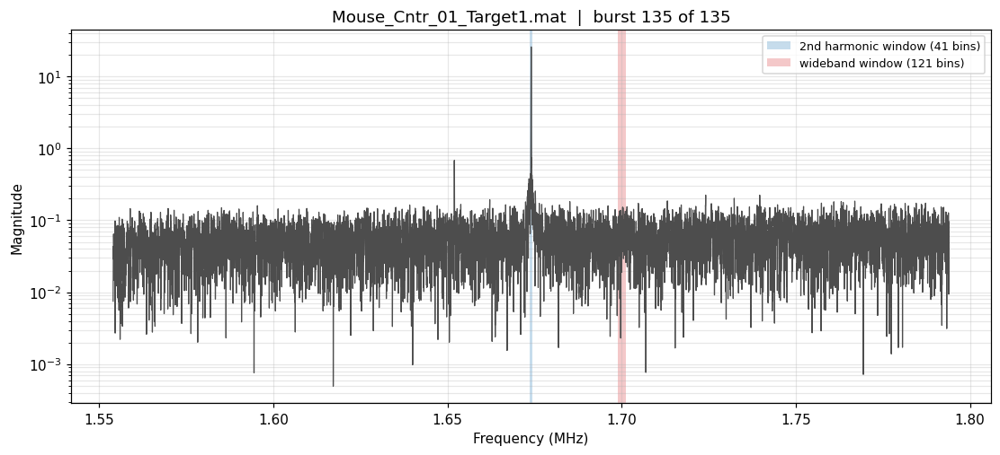
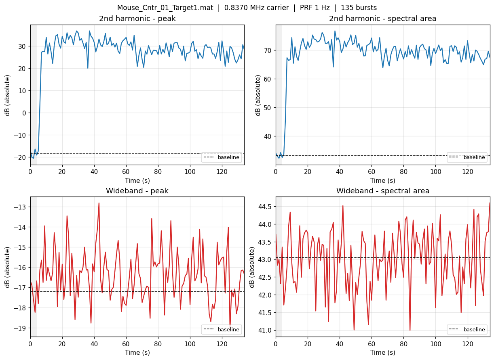
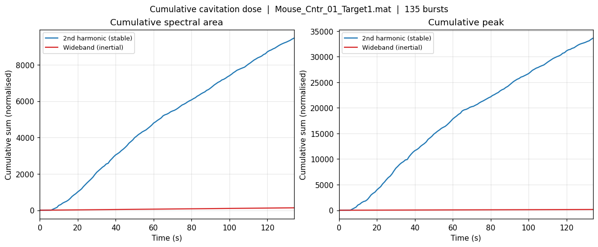
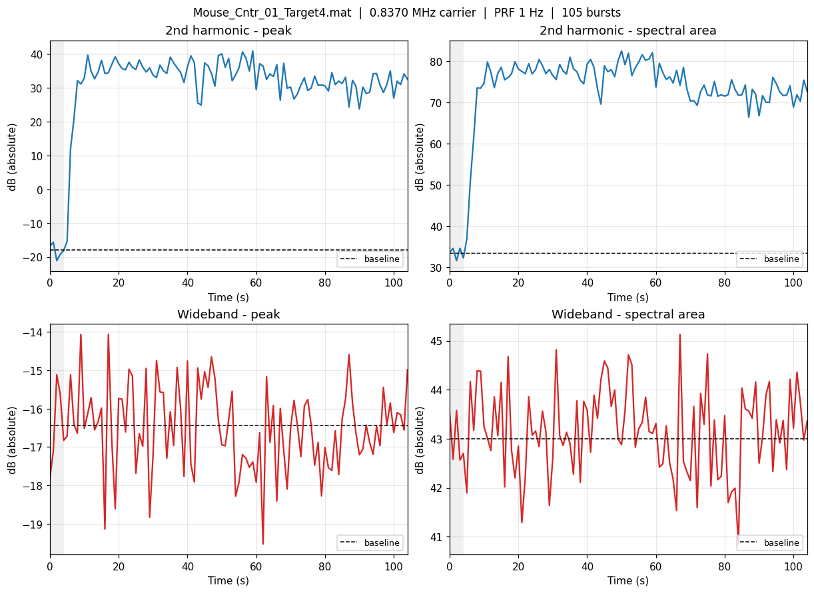

# Acoustic emission extraction

How to turn a raw `Mouse_Cntr_XX_TargetYY.mat` recording into per-burst cavitation
metrics, using the `fus` package in [`src/fus/`](../src/fus).

This is a Python port of the lab's `nt_ExtractHarmonicData.m`
([`reference/`](../reference/nt_ExtractHarmonicData.m)). It reproduces that script's
numbers exactly — see [Validation](#validation) — and adds a few things the original
doesn't surface.

---

## Contents

- [What the pipeline does](#what-the-pipeline-does)
- [Install](#install)
- [Command line](#command-line)
- [Python API](#python-api)
- [Figures](#figures)
- [Reading the numbers](#reading-the-numbers)
- [Validation](#validation)
- [Gotchas](#gotchas)
- [MATLAB ↔ Python reference](#matlab--python-reference)

---

## What the pipeline does

During a sonication the transducer fires one burst per second. Microbubbles in the
blood oscillate in the acoustic field and re-radiate sound, and two parts of that
re-radiated spectrum matter:

| Band | Physical origin | Meaning |
|---|---|---|
| **Second harmonic**, 2× carrier (1.674 MHz) | *Stable* cavitation — bubbles oscillating steadily | Correlates with BBB opening. This is what the controller regulates. |
| **Wideband**, 1.7 MHz | *Inertial* cavitation — bubbles collapsing violently | The damage signal. The controller backs off when it rises. |

The acquisition hardware has already run the FFT, so each burst arrives as a
**magnitude spectrum**, not a time series. Feature extraction is therefore band
selection and integration — there is no transform left to apply.

```
  .mat file
      │
      ├─ load_recording()      → spectra (n_bursts × 131072), metadata, controller state
      │
      ├─ band_window()  ×2     → index windows on 1.674 MHz and 1.7 MHz
      │
      ├─ compute_metrics()     → peak + integrated magnitude, per burst, per band
      │
      ├─ .normalised()         → ÷ mean of the pre-microbubble bursts
      │
      └─ .cumulative()         → running sum = acoustic "dose"
```

The last value of the cumulative harmonic area is the number that gets regressed
against delivered AAV. Everything else exists to make that number trustworthy.

---

## Install

```bash
python3 -m venv .venv && source .venv/bin/activate
pip install -r requirements.txt
pip install -e .          # puts `fus` on the path
```

Without the editable install, prefix commands with `PYTHONPATH=src`.

---

## Command line

```bash
python -m fus <files...> [options]
```

### Summarise one recording

```bash
python -m fus data/acoustic/20260611/Mouse_Cntr_01_Target1.mat
```

```
==============================================================
  Mouse_Cntr_01_Target1.mat
==============================================================
  Sample rate:       5.00 MHz
  Freq resolution:   19.0736 Hz
  FFT length:        131072 pts
  Nyquist:           2.50 MHz
  Bursts:            135  (programmed 120)
  PRF:               1.0 Hz
  Duration:          134 s
  Carrier:           0.8370 MHz
  2nd harmonic:      1.6740 MHz
  Wideband monitor:  1.7000 MHz
  Baseline bursts:   1 to 5
  Harmonic goal:     0.75 (deadband 0.700-0.800)
  Control gain Kp:   0.025
--------------------------------------------------------------
  2f window:         1.6736 - 1.6744 MHz (41 pts)
  WB window:         1.6989 - 1.7011 MHz (121 pts)
--------------------------------------------------------------
  Cumulative metrics (normalised to baseline)
  2nd harmonic - cumulative area: 9461.96   (xlsx units: 0.9462)
  2nd harmonic - cumulative peak: 33609.82
  Wideband     - cumulative area: 134.84
  Wideband     - cumulative peak: 149.66
  Harmonic/WB area ratio:         70.17
  AWG1 voltage range:             0.000 to 0.081 V
  AWG1 mean / cumulative:         0.0758 V / 9.856 V
==============================================================
```

When the safety interlock fired during a run, the summary says so:

```
  Harmonic goal:     0.95 (deadband 0.900-1.000)
  Control gain Kp:   0.025
  !! goal reduced mid-run to 0.802-0.902 (wideband interlock fired)
```

### Reduce a whole experiment day

```bash
python -m fus data/acoustic/20260611/*_Target*.mat --csv results/day1.csv --quiet
```

One row per target, ready to join against `Mouse_Controller_Data.xlsx`. Loading is
the slow part (a few seconds per ~0.5 GB file), so do this once and work from the CSV.

### Figures

```bash
python -m fus <file.mat> --plot                      # interactive
python -m fus <file.mat> --save-plots results/figures  # PNG
```

### Options

| Flag | Effect |
|---|---|
| `--plot` | Show the three figures interactively |
| `--save-plots DIR` | Write them as PNG instead |
| `--csv PATH` | One summary row per input file |
| `--baseline N` | Override the pre-microbubble burst count (default: read from file) |
| `--quiet` | Suppress the per-file summary |

---

## Python API

```python
from fus import extract

ex = extract("data/acoustic/20260611/Mouse_Cntr_01_Target1.mat")

print(ex.summary())

# Per-burst series, all shape (n_bursts,)
ex.metrics.peak_2nd
ex.metrics.area_2nd
ex.metrics.peak_wb
ex.metrics.area_wb

# Baseline-normalised, and the cumulative dose
norm = ex.metrics.normalised()
cum  = ex.metrics.cumulative()
cum.area_2nd[-1]              # 9461.96 — the headline number

# Metadata and controller state
ex.recording.n_bursts          # 135
ex.recording.harmonic_setpoint # 0.75  (midpoint of the deadband)
ex.recording.goal_was_reduced  # False
ex.recording.burst_times       # seconds, from the PRF
ex.recording.drive_voltage     # (n_bursts, 2) — AWG1, AWG2

# Flat dict for a DataFrame
ex.to_dict()
```

### Building a dataset

```python
import glob
import pandas as pd
from fus import extract

rows = [extract(f).to_dict() for f in
        sorted(glob.glob("data/acoustic/*/Mouse_Cntr_*_Target*.mat"))]
df = pd.DataFrame(rows)
df.to_parquet("data/processed/acoustic_features.parquet")
```

Then join to the experiment sheet on `(mouse, n_bursts, harmonic_setpoint)` — **not**
on the target index, for reasons in [Gotchas](#gotchas).

### Changing the analysis

Window placement and width are parameters, not constants:

```python
ex = extract(path,
             wideband_centre_hz=1_750_000,   # move the broadband monitor
             harmonic_half_win=40,           # widen the harmonic window
             n_baseline=10)                  # more pre-microbubble bursts
```

To add a band the script never looked at — subharmonic at ½f, ultraharmonic at 3/2f:

```python
from fus.extract import band_window, load_recording
import numpy as np

rec = load_recording(path)
sub = band_window(rec.freq_axis, 0.5 * rec.carrier_hz, 20, "subharmonic")
seg = rec.spectra[:, sub.indices]
peak_sub = seg.max(axis=1)
area_sub = seg.sum(axis=1) * rec.df_hz
```

---

## Figures

### 1. Window placement — check this first

```bash
python -m fus <file.mat> --plot     # third figure
```



One burst's spectrum around the second harmonic, log magnitude, with both analysis
windows shaded. Not part of the MATLAB script; it's the diagnostic that catches the
failure mode nothing else does.

Here the harmonic window (blue) sits dead on the 1.674 MHz line, which stands about
2.5 orders of magnitude above the noise floor, and the wideband window (red) is well
clear of it at 1.7 MHz. **If the windows are misplaced, every downstream number is
wrong and no summary statistic will tell you.** Run this on any new session,
especially if the carrier frequency changed.

### 2. Per-burst metrics



The four raw metrics against time, in dB, with the pre-microbubble window shaded and
the baseline level dashed. Reading it:

- The harmonic (blue, top) jumps roughly **48 dB** the moment microbubbles arrive at
  ~5 s, then drifts slowly down over the run as bubbles clear the circulation. That
  decay is why the controller has to keep raising voltage to hold its setpoint.
- The wideband (red, bottom) stays at baseline the whole time, scattering by about
  ±1.5 dB. No inertial cavitation — this exposure stayed in the safe regime.

> **Axis label.** The MATLAB script labels these "dB re baseline" but plots
> `20*log10(peak)` — the absolute value, with a baseline line drawn on top. The
> values are not baseline-referenced. That behaviour is reproduced faithfully here
> and the axis relabelled **"dB (absolute)"** so the plot isn't misread. Worth
> confirming with Bernie that the original label was just a slip.

### 3. Cumulative dose



Running sums of the *normalised* series — these genuinely are baseline-referenced.
The endpoints are what go into the spreadsheet and get regressed against AAV
delivery.

The shape carries information the endpoint throws away. A straight line means a
steady exposure. A knee means the controller changed behaviour partway through.
Since this is a sum over bursts, a long weak sonication and a short intense one can
land on the same total — separating those two cases is exactly what the
`N Bursts` × `Harmonic Goal` design was built to test.

### A run where the interlock fired



`Mouse_Cntr_01_Target4` was prescribed a goal of 0.95, but the file records
`curHarmGoal` ending at 0.802–0.902 — the wideband interlock reduced the target
mid-sonication, and `goal_was_reduced` is `True`.

There is a visible step down in the harmonic at around 60 s, consistent with that
reduction. Note the plot alone doesn't *establish* the link — the wideband trace has
no obvious spike at 60 s — so treat the flag as the evidence and the step as
corroboration. What matters for modelling is that **this target did not receive the
exposure the spreadsheet says it was prescribed.**

---

## Reading the numbers

`to_dict()` / the CSV emit:

| Column | Meaning |
|---|---|
| `n_bursts` | Bursts actually stored |
| `programmed_bursts` | The file's `NBursts` — the *requested* sonication length, ~15 lower |
| `harmonic_setpoint` | Midpoint of the controller deadband; matches the spreadsheet's `Harmonic Goal` |
| `goal_was_reduced` | True if the wideband interlock lowered the target mid-run |
| `cum_2nd_harmonic_area` | The headline dose. Matches the lab's "Cumulative 2nd Harmonic AUC" plots |
| `cum_2nd_harmonic_xlsx` | Same, ÷ 1e4 — the spreadsheet's units |
| `cum_wideband_area` | Cumulative broadband, i.e. accumulated inertial cavitation |
| `harmonic_wideband_ratio` | Crude stable-vs-inertial index. High = stayed in the useful regime |
| `mean_voltage`, `cum_voltage` | AWG1 drive. Mean is over sonicating bursts only |

**Peak vs. area.** Peak is the tallest bin in the window; area is the window sum times
the bin width — a Riemann integral of *magnitude*, not power. Peak is the more
sensitive detector of a narrow spectral line; area is more robust to that line
drifting in frequency. The lab's spreadsheet uses area.

**Why normalise.** The pre-microbubble bursts capture the response of *this* animal
and *this* coupling with no cavitation present. Dividing by their mean removes
per-animal differences in skull attenuation and transducer coupling, which is what
makes values comparable across mice. A normalised value of 1.0 means
"indistinguishable from baseline".

---

## Validation

Run against 19 targets from mice 1–3 of the 2026-06-11 session and compared to
`Mouse_Controller_Data.xlsx`. **All 15 unambiguous targets match to four decimal
places** on cumulative 2nd harmonic, mean voltage, and cumulative voltage. The other
4 aren't discrepancies — the join heuristic can't separate two targets on the same
mouse that share both burst count and goal.

```
file                                  N  goal  cum_area/1e4  xls_cum   meanV   xls_V
Mouse_Cntr_01_Target1.mat           135  0.75        0.9462   0.9462  0.0758  0.0758
Mouse_Cntr_01_Target2_Repeat.mat     60  1.05        1.1015   1.1015  0.0969  0.0969
Mouse_Cntr_01_Target4.mat           105  0.95        1.3457   1.3457  0.0958  0.0958
Mouse_Cntr_02_Target1.mat           135  0.65        0.6247   0.6247  0.0913  0.0913
Mouse_Cntr_02_Target2.mat           105  0.85        1.0215   1.0215  0.0961  0.0961
Mouse_Cntr_02_Target3.mat            75  0.95        0.7665   0.7665  0.1035  0.1035
Mouse_Cntr_02_Target4.mat           135  0.75        1.0703   1.0703  0.1004  0.1004
Mouse_Cntr_02_Target5.mat            75  0.65        0.3688   0.3688  0.0821  0.0821
Mouse_Cntr_02_Target6.mat           255  0.85        1.5973   1.5973  0.0951  0.0951
Mouse_Cntr_03_Target1.mat           135  0.75        0.8752   0.8752  0.0889  0.0889
Mouse_Cntr_03_Target2.mat            60  0.75        0.4201   0.4201  0.0847  0.0847
Mouse_Cntr_03_Target3.mat           255  0.95        1.7159   1.7159  0.0740  0.0740
Mouse_Cntr_03_Target4.mat           105  1.05        1.1035   1.1035  0.1006  0.1006
Mouse_Cntr_03_Target5.mat           105  0.65        0.4233   0.4233  0.0827  0.0827
Mouse_Cntr_03_Target6.mat           135  0.95        1.0912   1.0912  0.0947  0.0947
```

Two spreadsheet conventions had to be reverse-engineered to get this match, and both
are now encoded in the code:

1. **`Cumulative 2nd Harmonic` is scaled by 1e4.** The spreadsheet divides the raw
   cumulative spectral area by 10,000. The lab's own plots use the unscaled value,
   which is why their y-axis runs to 4×10⁴. Exposed as `XLSX_HARMONIC_SCALE`.
2. **`Mean Voltage` averages over sonicating bursts only.** The first 5 bursts fire
   at 0 V, so a plain mean over all bursts undercounts. Verified: exactly 5 zeros in
   every file checked. `cum_voltage` is the plain sum and needs no correction.

---

## Gotchas

**`HarmGoal` is a deadband, not a setpoint.** The file stores `[0.7, 0.8]`; the
spreadsheet says `0.75`. It's the midpoint — voltage is raised below the lower bound
and lowered above the upper. Use `Recording.harmonic_setpoint`, which does the
conversion.

**Filename `TargetYY` ≠ spreadsheet `Treatment #`.** Mouse 1 has a `Target2_Repeat`
file and 7 spreadsheet rows, which shifts the numbering for everything after it.
Join on `(mouse, n_bursts, harmonic_setpoint)`. Assuming the target index maps
straight through will silently corrupt the dataset.

**`N Bursts` in the spreadsheet is the stored count, not the file's `NBursts`.** The
file's `NBursts` is the *programmed* sonication length; stored bursts run ~15 higher.
Both are reported, as `n_bursts` and `programmed_bursts`.

**The prescribed goal isn't always the delivered goal.** Check `goal_was_reduced`
before treating `harmonic_setpoint` as the exposure that actually happened.

**These are MATLAB v5 files.** `scipy.io.loadmat` reads them; `h5py` will not, despite
the file sizes. The whole file loads into memory — reduce once, cache, don't reload.

**Baseline `_BL` files aren't burst-aligned.** They store more spectra than voltage
rows, so those two series can't be plotted against each other. The loader warns.

---

## MATLAB ↔ Python reference

| `nt_ExtractHarmonicData.m` | `fus` |
|---|---|
| `peak_2nd`, `area_2nd` | `ex.metrics.peak_2nd`, `.area_2nd` |
| `peak_wb`, `area_wb` | `ex.metrics.peak_wb`, `.area_wb` |
| `*_norm` | `ex.metrics.normalised()` |
| `cum_*` | `ex.metrics.cumulative()` |
| `V1_burst`, `V2_burst` | `ex.recording.drive_voltage[:, 0]`, `[:, 1]` |
| `t_burst` | `ex.recording.burst_times` |
| `f_axis`, `df` | `ex.recording.freq_axis`, `.df_hz` |
| `f_carrier`, `f_2nd` | `ex.recording.carrier_hz`, `.second_harmonic_hz` |
| `N_baseline` | `ex.recording.n_baseline` (from `DummyBursts`, not hardcoded) |
| `win_2nd`, `win_wb` | `ex.harmonic_window.indices`, `ex.wideband_window.indices` |
| §7 figure | `plots.plot_cavitation_metrics()` |
| §8 figure | `plots.plot_cumulative_dose()` |
| — | `plots.plot_spectrum()` *(new)* |

Two deliberate differences from the original:

- **Window clipping.** MATLAB silently produces an invalid index if a window runs off
  the frequency axis. Here it's clipped and the caller warned — an asymmetric window
  biases the integrated area, which shouldn't pass unnoticed.
- **Vectorised.** The script loops burst by burst; the whole spectra array is already
  in memory here, so both metrics are one reduction along the frequency axis. Results
  are identical.
