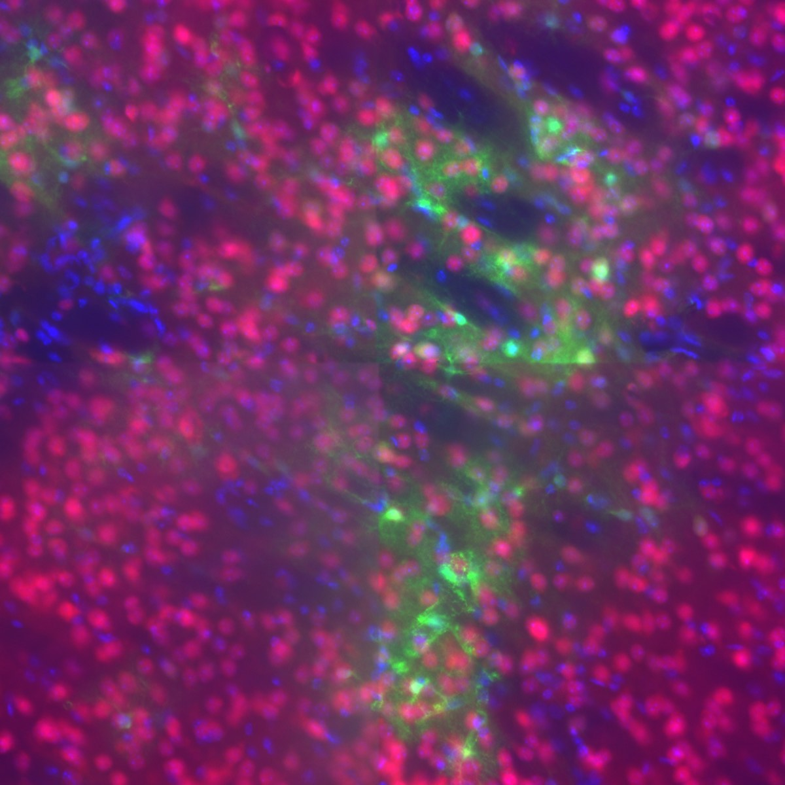

# Decision 001 — How do we measure delivered AAV?

**Status:** OPEN — needs a call before quantification starts
**Raised:** 2026-09-10
**Decides:** the label the model is trained against, for the whole project
**Needs input from:** Nick Todd, Bernie Owusu-Yaw

---

## The question

Every target gets one number that says how much AAV was delivered there. Two candidates:

- **A — GFP area coverage.** Threshold the GFP channel; measure the fraction of the ROI
  above threshold. One number per ROI, no per-cell reasoning.
- **B — Cell segmentation.** Segment nuclei, decide which are GFP-positive, report
  transduced cell count (and/or the GFP+ fraction) per ROI.

This is not a reversible implementation detail. It determines what the primary endpoint
means, whether our numbers are comparable to the lab's published work, and how the
manuscript's central claim is phrased. Changing it in week 10 means re-quantifying
everything.

---

## Evidence gathered

Measured directly from `Mouse_01/Image.vsi` via QuPath/Bio-Formats, not assumed:

| Property | Value |
|---|---|
| Sections | 5 (series 2–6) |
| Size | ~33,000 × 33,000 px each |
| Pixel size | **0.325 µm/px** (20× objective) |
| Channels | DAPI, FITC (native GFP), TRITC (GFP antibody), CY5 (NeuN) |
| Bit depth | UINT16 |
| Z-slices | **1** |

A ~10 µm nucleus spans **~31 px**. Resolution is not the constraint on either option.

`z = 1` is a single widefield plane through a thick section — it integrates light from
the full section depth, so nuclei at different depths superimpose.

### What the tissue looks like at native resolution

A 520 µm field from the brightest plume in section 1. Three things this shows:

1. **Nuclei are crisp and separable.** Discrete, round, ~31 px. Good substrate for
   nuclear segmentation.
2. **Out-of-focus haze is substantial.** Sharp nuclei sit superimposed on blurred ones
   from other depths — the `z = 1` consequence.
3. **Most GFP is neuropil, not somata.** The green is a filamentous web of processes.
   There are perhaps 10–20 clearly GFP-filled cell bodies in a field containing several
   hundred nuclei. The CBA promoter fills the whole cell, so one transduced neuron's
   arbor sprays signal across territory belonging to dozens of untransduced neighbours.
4. **Tile seams are visible** — sharp intensity steps at stitching boundaries, running
   vertically and horizontally through the field.

---

## The case for A (area coverage)

**Method continuity.** Owusu-Yaw et al. (2024) — same lab, same AAV9-GFP construct, same
rig — used exactly this: threshold, percent area above threshold, averaged over sections.
Our numbers stay directly comparable to a published result from this group.

**It matches the available n.** ~5 usable targets per animal. Per-cell richness has
nowhere to go at that scale.

**No attribution decision.** Neuropil GFP is delivered transgene expression. It counts.
Nothing has to be assigned to a particular cell.

**Robust to the `z = 1` problem.** Coverage doesn't care whether two nuclei merged in z.

## The case for B (segmentation)

**Area coverage saturates.** In a bright plume core, coverage approaches 100% and stops
discriminating between a strong exposure and a very strong one. Counts don't saturate.
This is a real weakness of A, partially — not fully — mitigated by recording integrated
intensity alongside.

**It separates two distinct outcomes.** "More cells transduced" vs. "the same cells
expressing more strongly" are biologically different, and coverage conflates them.

**Nuclear segmentation is genuinely tractable here.** At 0.325 µm/px with this nuclear
morphology, StarDist or Cellpose should perform well.

**It's the honest route to cell-type specificity** — what fraction of transduced cells
are neurons vs. astrocytes. Though note that's a *different question* from how much was
delivered, and it's what the 2024 paper used counting for.

---

## The argument that currently tips it toward A

**Segmentation's error is correlated with the independent variable.**

Calling a nucleus GFP+ means deciding whether nearby green belongs to it or to a process
passing through. In a plume core — dense neuropil — nearly every nucleus is surrounded by
green, so false positives rise. At a plume edge, faint somata are missed, so false
negatives rise.

Both failure modes scale with delivered dose. A segmentation-based count would therefore
**manufacture part of the dose-response it is being used to measure**, with no clean way
to separate the real effect from the artefact.

Area coverage has no equivalent failure mode.

> This is the crux. If it can be shown that GFP+ calling is accurate and *unbiased across
> the dose range*, the objection dissolves and B becomes the better endpoint on the
> saturation argument alone.

---

## Honest weaknesses on both sides

**Against A:** saturation in plume cores (above). And the visible tile seams hurt
*thresholding* more than segmentation — a global threshold clips differently either side
of a seam. If A is chosen, per-tile flat-field correction must be in the protocol.

**Against B:** no z-stacks, so absolute cell density is unknowable and only relative
counts between identically-imaged ROIs are meaningful. Plus every extra decision —
nuclear model, colocalisation rule, intensity cutoff — needs its own validation, and each
one is a place for dose-correlated bias to enter.

---

## Current estimates (to be replaced with measurement)

These are my judgment, not measured. Flagged as such deliberately.

| Task | Estimated accuracy | Basis |
|---|---|---|
| Total nuclei, vs. human on the same 2D plane | **85–93% F1** | Nuclei are crisp at 31 px; density is high but tractable |
| Total nuclei, vs. true cells in tissue volume | **Systematically low, unquantifiable** | `z = 1` superposition, no way to correct without z-stacks |
| GFP+ cell calling | **60–80%**, worse in plume cores | Neuropil-dominant signal; attribution is genuinely ambiguous |

---

## How to resolve this

Rather than argue from estimates, measure it. Roughly an afternoon:

1. Run StarDist (QuPath extension) on the DAPI channel of the crop above, plus two more:
   one plume edge, one background region.
2. Bernie or Andrew manually counts GFP+ cells in three 200 µm boxes — **plume core,
   plume edge, background** — blinded to the automated result.
3. Compute precision, recall, and F1 for GFP+ calling in each box.

**Pre-registered decision rule** — agreed before seeing the numbers:

| Result | Decision |
|---|---|
| GFP+ F1 ≥ 0.85 **and** roughly equal in core vs. edge | **Adopt B.** Bias concern is empirically dead; saturation argument wins. |
| GFP+ F1 ≥ 0.85 but materially worse in the core | **Adopt A**, primary. Revisit B if a bias correction can be validated. |
| GFP+ F1 < 0.85 | **Adopt A.** Record segmentation as a Phase 4 secondary endpoint for cell-type specificity only. |

Fixing the rule in advance is the point — with 6 doses per animal and a visible intensity
gradient, choosing the endpoint after seeing which one gives a nicer dose-response is
exactly how a spurious result gets published.

---

## What's needed from Nick and Bernie

1. **Is there any reason segmentation must be the primary endpoint** that isn't captured
   above — a reviewer expectation, a comparison to another group's work, a planned figure?
2. **Is confocal time available** for a subset? Z-stacks would remove the `z = 1`
   objection to B outright and would make cell-type specificity properly quantifiable.
3. **Is the 0.85 threshold the right bar**, or should it be stricter given this feeds a
   published dose-response?
4. **Who does the manual counts**, and can they be blinded to exposure parameters?

---

## Related

- [`ground-truth-spec.md`](../ground-truth-spec.md) §2 currently assumes A. If this
  decision lands on B, §6 (endpoint), §7 (ROI), and §10 (phasing) all need rewriting.
- The target↔recording correspondence problem (spec §3) is **independent of this decision
  and blocks either option.** It should be resolved first regardless.
