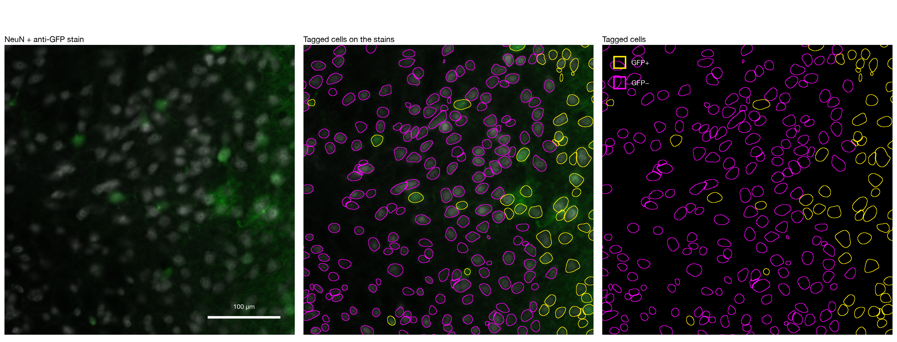

# Cell-level GFP tagging (pipeline B)

**Status (2026-09-30):** piloted on a 3 × 3 mm crop of Mouse 2 `slide04_s3`, then run in
production on every target ROI of both mice ([pipeline B](#in-production-pipeline-b)).
**Not yet checked against a hand count.** Pilot code and outputs are in
[`segmentation_alpha/`](../segmentation_alpha/); production is
[`src/fus/cells.py`](../src/fus/cells.py). This is the cell-level alternative (option B) in
[decision 001](decisions/001-delivery-endpoint.md). Pixel coverage (pipeline A) runs
alongside it, and the endpoint decision is still open.

The question: instead of the fraction of an ROI's *pixels* that are GFP+, how many
*neurons* took up the virus?

<p align="center">
  
</p>

*A 400 µm window on the edge of the T3 ROI. Left: NeuN (grey) and the anti-GFP stain
(green). Middle and right: each StarDist cell outlined **yellow** (GFP+) or **magenta** (GFP−)
at the production threshold, 4.05× the slice's background: 269 cells, 61 GFP+. Made by
`segmentation_alpha/export_figures.py`, which reproduces the napari view. The two panels
also exist as `gfp-tagging-stains.png` and `gfp-tagging-cells.png`.*

---

## Pipeline

```
full-resolution export of the section (0.325 µm/px)       notebooks/view_slice.ipynb
        │ make_crop.py            3 × 3 mm square centred on the finetuned T3 ROI
        ▼
crop (DAPI, native GFP, anti-GFP, NeuN)
        │ run_stardist.py         StarDist 2D_versatile_fluo on NeuN (CY5), defaults
        ▼
one outline per neuron
        │ gfp_tagging.py          mean normalised anti-GFP per cell → threshold
        ▼
GFP+ / GFP− per cell, by distance to the target           gfp_tagging.ipynb (napari)
```

| Step | Choice | Why |
|---|---|---|
| Crop | 3 × 3 mm around T3 (T3 reads 86% pixel coverage) | Covers the whole plume and reaches tissue > 1.5 mm from every target, giving a GFP-free reference |
| Cells | StarDist on NeuN | ~10× faster than Cellpose-SAM; see the comparison below |
| Normalisation | anti-GFP rescaled over the **whole section's** tissue: 0 = 1st percentile (70 counts), 1 = 99.9th (15,671). Linear, not clipped | The same scale whatever crop is analysed |
| Score | mean normalised anti-GFP over the cell's pixels | Your call (2026-09-30): an intensity-weighted average, one threshold |
| Threshold | Otsu on log₁₀ of the cell scores: **0.058** | Scores span two decades and are bimodal on a log scale: a background peak near 0.014 and a plume hump near 0.2–0.4. Log-Otsu sits in the valley |
| **Production score** | cell mean raw anti-GFP ÷ the section's background (median anti-GFP over tissue, 275 counts here); log-Otsu → **4.05×** | Replaced the percentile scale once it failed on Mouse 1 ([below](#in-production-pipeline-b)). On this crop it agrees with the 0.058 calls for 98.4% of cells |

## Results (3 × 3 mm crop)

StarDist found **16,723** NeuN cells in 84 s. At the production threshold **26.6%** are GFP+
(28.2% on the earlier log-Otsu scale), concentrated on the target:

| Distance to nearest target | Cells | **Production (4.05× bg)** | log-Otsu, 0.058 | reference, 0.021 | linear Otsu, 0.261 |
|---|---|---|---|---|---|
| 0–0.25 mm | 308 | **100%** | 100% | 100% | 75% |
| 0.25–0.5 mm | 1,123 | **97%** | 97% | 99% | 64% |
| 0.5–0.87 mm (ROI edge) | 3,948 | **56%** | 60% | 88% | 24% |
| 0.87–1.25 mm | 6,595 | **12%** | 14% | 50% | 2% |
| 1.25–1.5 mm | 3,234 | **0.5%** | 0.6% | 16% | 0% |
| 1.5–2.25 mm | 1,515 | **0.1%** | 0.2% | ~1% | 0% |

The two alternative thresholds bracket the first pass:
- **Reference (0.021)** is the 99th percentile of random cell-shaped patches in tissue more
  than 1.5 mm from every target. It's permissive: it also takes in the plume's dim halo.
- **Linear Otsu (0.261)** is strict: it cuts into the plume population itself.

`THRESHOLD` in the notebook switches between them, or takes any number.

Source files, in `segmentation_alpha/results/`:
`mouse02_slide04_s3_T3_3000um_gfp_threshold.json`, `_gfp_cells.csv` and `_gfp_profile.csv`.

## Choosing the segmentation model

Both models ran with default settings on the NeuN channel of a 500 µm crop at the same
centre (`results/model_comparison_500um.csv`):

| | StarDist | Cellpose-SAM |
|---|---|---|
| Cells | 428 | 308 |
| Median diameter | 15.5 µm | 14.8 µm |
| 10th–90th percentile diameter | 9.2–18.4 µm | 10.5–19.2 µm |
| Run time | 2.3 s | 21.7 s (Apple GPU) |

They agree on 271 cells (overlap IoU ≥ 0.5; agreement F1 0.74). StarDist finds 157 that
Cellpose doesn't, and Cellpose 37 that StarDist doesn't. StarDist's smaller 10th
percentile suggests some of its extras are fragments or dim out-of-focus blobs.
**StarDist was chosen for speed.** This compares the models with each other; neither has
been scored against a hand count.

Each model runs in its own environment inside `segmentation_alpha/`: `.venv` holds
PyTorch and Cellpose, and `.venv-stardist` holds TensorFlow and StarDist. Both are
git-ignored.

## Caveats

- **No ground truth yet.** Neither the outlines nor the GFP+ calls have been checked against
  a blinded hand count. Decision 001's pre-registered test (GFP+ F1 ≥ 0.85, equal in plume
  core and edge) has not been run.
- **The threshold was chosen after seeing the histogram.** The plan was the reference
  threshold; the switch to log-Otsu came from the bimodal log histogram. All three stay
  visible in the notebook.
- **Bright surroundings can carry a cell over the threshold.** A neuron sitting in
  GFP-filled processes scores high even if its own body isn't transduced, and NeuN outlines
  include some cytoplasm. An earlier version subtracted a ring around each cell to remove
  the surroundings; only about a third of core neurons stood out from their surroundings.
  It was replaced by the plain mean, as asked.
- **One focal plane through a thick section.** DAPI and NeuN line up within about 1 px
  overall, but many individual cells don't match, which fits each colour being in focus at
  a different depth. This was measured once in the 500 µm crop and isn't scripted.
  Segmentation therefore uses NeuN alone.
- **What CY5 shows on Mouse 2 is unconfirmed.** Our docs call it NeuN on the basis of
  Mouse 1, but the lab's protocol uses CY5 for NeuN, GFAP or S100β depending on the panel.
  Ask Nick before reading these as neurons.
- **One crop, one section, one animal.** Nothing here has been run across targets or mice.

## In production: pipeline B

[`src/fus/cells.py`](../src/fus/cells.py) runs this per target ROI, alongside pipeline A
(pixel coverage, `fus.histology`), on the **same ROI**: the finetuned shape, or else the
clicked template. For each section it:
1. exports the six ROI boxes (plus 30 µm) at full resolution straight from the `.vsi`, in
   one QuPath launch (`scripts/qupath/export_regions.groovy`), uncompressed. The regions
   are pixel-identical to `convert-ome` exports.
2. segments NeuN with StarDist (`scripts/stardist_segment.py`), one process per ROI, each
   started as soon as its crop is written. The network runs on the Apple GPU
   (`segmentation_alpha/.venv-stardist-gpu`: TensorFlow 2.18 + tensorflow-metal). The GPU
   gives the same cells as the CPU (5,717 of 5,717 matched on one crop). The slow step,
   StarDist's single-core merging of candidate outlines, is what the parallel processes
   speed up: 19 s against 2.7 s for the network on one crop.
3. scores each cell whose centre is in the ROI as **fold over background**: its mean raw
   anti-GFP divided by the slice's median anti-GFP over tissue. It's GFP+ above **4.05×**.

Time per slice: ~55 s (Mouse 1) to ~85 s (Mouse 2), down from 3–5 min.

**Why fold over background.** The first production threshold (0.0575 on a
1st–99.9th-percentile scale) tagged **5–14% of Mouse 1's no-FUS control**, because Mouse 1's
un-transduced tissue is several times brighter than Mouse 2's. Slice backgrounds run 435–1,927
counts on Mouse 1 and 275 on the pilot slice. Dividing by each slice's own background fixes it:
the control now reads 0.7–1.3% GFP+ in all four Mouse 1 slices. The 4.05× threshold is
the log-Otsu split of the fold score on the same 3 mm pilot crop. It tags 26.6% of those
cells and agrees with the earlier calls on 98.4% of them
(`results/mouse02_slide04_s3_T3_3000um_gfp_threshold.json` → `fold`).

It writes one row per ROI to `results/histology/cells/mouseNN_cell_rois.csv`: cell count,
density, GFP+ count and fraction, median fold score, slice background.

On Mouse 2 `slide04_s3`, the cell counts per ROI are unchanged by the speedups (6,774 / 5,187 /
4,162 / 6,373 / 4,804 / 4,284). Check any section in
[`notebooks/cell_pipeline_one_slice.ipynb`](../notebooks/cell_pipeline_one_slice.ipynb).

## Reproduce

```bash
.venv/bin/python segmentation_alpha/make_crop.py 3000
segmentation_alpha/.venv-stardist/bin/python segmentation_alpha/run_stardist.py \
    segmentation_alpha/mouse02_slide04_s3_T3_3000um.ome.tif
.venv/bin/python segmentation_alpha/gfp_tagging.py segmentation_alpha/mouse02_slide04_s3_T3_3000um.ome.tif
.venv/bin/python segmentation_alpha/export_figures.py        # the two images above
.venv/bin/python segmentation_alpha/compare_models.py        # needs run_cellpose.py output
```

`segmentation_alpha/gfp_tagging.ipynb` does the first three steps when anything is missing,
and opens the result in napari. Setting up the two environments:
`python3.12 -m venv segmentation_alpha/.venv && segmentation_alpha/.venv/bin/pip install cellpose packaging tifffile`,
and the same with `.venv-stardist` and `stardist tensorflow tifffile`.
