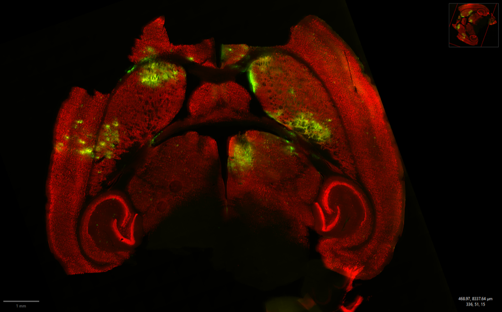

# Ground truth spec — quantifying delivered AAV

**Status:** draft for review with Nick Todd and Bernie Owusu-Yaw
**Purpose:** define the measurement that serves as the model's label, before any is collected

---

## 1. What we need, exactly

The model maps acoustic emissions to delivered AAV. That means the label is:

> **one scalar per sonication target**, attributable to a specific `.mat` recording

Not per mouse, not per hemisphere, not per section. **Per target.** Each animal receives
6 sonications at 6 stereotactic coordinates, so each animal yields up to 6 labelled
training rows — and the within-animal contrasts (same skull, same bubble kinetics,
different exposure) are the most valuable data in the study.

Everything in this spec follows from that requirement.

---

## 2. Recommendation: area coverage first, segmentation later

> **This is an open decision, not a settled one.** See
> [`decisions/001-delivery-endpoint.md`](decisions/001-delivery-endpoint.md) for the full
> argument on both sides, the cell-resolution evidence, and the pre-registered test that
> resolves it. The rest of this spec assumes area coverage; if the decision lands the
> other way, §6, §7 and §10 need rewriting.

**Short version: I don't think cell segmentation should be the first step.** Four reasons.

**The label is a scalar; segmentation produces a population.** GFP area coverage —
threshold the GFP channel, measure the fraction of the ROI above threshold — yields the
scalar directly. Segmentation yields per-cell counts, intensities, and morphologies:
richer, but that richness has nowhere to go when the design gives ~5 usable data points
per animal. Complexity in the label doesn't buy anything until n is large.

**Method continuity with the lab's own published work.** Owusu-Yaw et al. (2024) — same
lab, same AAV9-GFP construct, same rig — quantified delivery as *GFP area coverage above
threshold, as percent of hemisphere, averaged over 12 sections per animal*. Reusing that
method makes our numbers directly comparable to a published result from this group.
Inventing a segmentation-derived metric means validating it from scratch and losing the
anchor.

**The binding constraint is spatial attribution, not measurement quality.** See §3 — the
mapping from GFP plume to acoustic recording is *not currently established*, and for the
one imaged mouse it is demonstrably inconsistent. Perfect segmentation attached to the
wrong acoustic trace produces a confidently wrong model. This is the problem to solve
first.

**Segmentation is unusually hard on this material.** Looking at the one imaged mouse
(§4): sections are torn and fragmented, GFP appears as diffuse neuropil signal at least
as much as somatic labelling, and transduced cells overlap densely in plume cores.
Defining "a GFP+ cell" would require co-segmenting NeuN and making a colocalisation call
per cell — several decisions, each needing its own validation.

**Where segmentation does belong.** Cell-type specificity: *what fraction of transduced
cells are neurons vs. astrocytes*. That is a real and interesting secondary endpoint, and
it is exactly what Owusu-Yaw used cell counting for — 3 sections per animal, confocal,
manually counted by a blinded observer. It answers "what did we transduce", not "how
much". Phase 3 in §10.

> If Nick or Bernie want segmentation as the primary endpoint anyway, say so and I'll
> restructure — but I'd want to hear the argument for what it buys over area coverage at
> this n.

---

## 3. Blocking issue: target ↔ recording correspondence

**This must be resolved before any tissue is quantified.**

Each animal has 6 planned targets. The `.mat` files carry a target plan in
`data.posx.xyz` — a 6×3 table of stereotactic coordinates, identical in every file for a
given animal:

| Target | Coordinate (x, y) | Side |
|---|---|---|
| 1 | ( 1.5, 5.0) | right, dorsal |
| 2 | ( 3.5, 3.0) | right, lateral |
| 3 | ( 1.5, 2.5) | right, ventral |
| 4 | (−1.5, 5.0) | left, dorsal |
| 5 | (−3.5, 3.0) | left, lateral |
| 6 | (−1.5, 2.5) | left, ventral |

The file does **not** record which of the six it was — that comes from the filename
(`TargetYY` → row YY). I verified this mapping against the target overlay in
`Mouse_01_AAV_Images.pptx`: the sign of *x* matches the left/right placement of the
numbers, and the *y* ordering matches their dorsal/lateral/ventral placement. The
correspondence is exact.

### The inconsistency

Comparing the slide deck's per-position annotations against the acoustic files for the
same animal:

| Position | Slide deck says | Acoustic file says | |
|---|---|---|---|
| 1 | 420 bursts, goal 0.85 | `Target1`: 120 bursts, goal 0.75 | ❌ |
| 2 | 45 bursts, goal 1.05 | `Target2_Repeat`: 45 bursts, goal 1.05 | ✓ |
| 3 | **No FUS control** | `Target3`: 240 bursts, goal 0.55 | ❌ |
| 4 | 90 bursts, goal 0.95 | `Target4`: 90 bursts, goal 0.95 | ✓ |
| 5 | 60 bursts, goal 0.85 | `Target5`: 60 bursts, goal 0.85 | ✓ |
| 6 | 240 bursts, goal 0.55 | `Target6`: 240 bursts, goal 0.55 | ✓ |

Four of six agree exactly, which confirms the deck and the files describe the same animal
and the same numbering scheme. Two disagree, and they are the two unusual entries — a
420-burst run that appears in no acoustic file, and a no-FUS control that has a
240-burst recording against it.

Note also that `Target2` (60 bursts, 0.85) exists *and* `Target2_Repeat` (45, 1.05)
exists. The deck reports the repeat. Whatever happened at position 2 during the session
is not self-documenting.

### Questions for Nick

1. Is `Target2` a failed run superseded by `Target2_Repeat`, and should it be discarded?
2. Position 1: does a 420-burst recording exist elsewhere, or is the deck's label wrong?
3. Position 3: was it a no-FUS control (and `Target3.mat` is misnamed), or was it
   sonicated at 240/0.55 (and the deck's label is wrong)?
4. Is `TargetYY` → `xyz` row YY guaranteed, or can the operator re-order targets within a
   session?
5. Was MRI contrast-enhancement acquired per target? If so it is an independent check on
   which positions actually opened.

**Until 2 and 3 are answered, this animal yields 3 unambiguous labelled targets, not 6.**

---

## 4. What the tissue looks like



One section from the imaged mouse. Red is NeuN (neuronal nuclei; hippocampus clearly
resolved). Green is GFP — AAV transduction.

Three things this settles:

**GFP is focal, not diffuse.** Discrete plumes, several millimetres apart, each
corresponding to a sonication target. They are visually separable, which is what makes
per-target attribution feasible at all.

**Plume intensity and extent both vary.** Some plumes are bright and compact, others
faint and spread. Area coverage and integrated intensity are therefore *not*
interchangeable — see §6.

**Sections are damaged.** Tears, detached fragments, a piece of cortex separated from the
rest. Any ROI scheme has to tolerate missing tissue, and any per-section normalisation
has to use a denominator that is robust to it.

---

## 5. Imaging requirements

Following Owusu-Yaw et al. (2024) so results stay comparable:

| Parameter | Value |
|---|---|
| Scanner | Olympus VS120 slide scanner |
| Objective | 20× |
| Channels | DAPI (Hoechst, nuclei), TRITC (GFP), Cy5 (NeuN / GFAP / S100β) |
| Sections per animal | 12, spanning the targeted AP range |
| Format | `.vsi` + `.ets` tile stacks, read in QuPath |

**Additions for this study:**

- **Every section must carry the AP coordinate** it was cut at, or at minimum its ordinal
  position in the series with known section thickness and interval. Without AP position,
  a plume cannot be assigned to a target that differs from its neighbour only in *y*.
- **Exposure settings must be identical across all sections and all animals**, and
  recorded. If integrated intensity is used at all (§6), varying exposure invalidates
  every between-animal comparison.
- **Include the native GFP channel as well as the GFP antibody stain.** The deck shows
  both were captured ("GFP – Native", "GFP – Stain"). Native fluorescence is not
  amplified and is the more honest measure of expression; the stain is more sensitive.
  Decide which is primary and keep it fixed.

---

## 6. Primary endpoint

**GFP area coverage within a target ROI**, defined as:

```
coverage = (pixels above threshold within ROI) / (tissue pixels within ROI)
```

Reported per target, averaged across the sections in which that target appears.

**Secondary, recorded at the same time:** integrated GFP intensity over the ROI
(sum of pixel values ÷ ROI area — the "integrated density" used for GFAP in the 2024
paper).

Both are cheap to compute once ROIs exist, and they answer different questions: area
coverage measures *how much tissue was reached*; integrated intensity measures *how
strongly it expressed*. A high-pressure exposure that transduces a small region intensely
and a gentle one that transduces a wide region faintly are distinguishable only if both
are recorded. Given that separating exposure duration from exposure intensity is the
whole point of the `N Bursts` × `Harmonic Goal` design, record both.

---

## 7. ROI definition

This is the step where a defensible choice matters most, and I'd want Bernie's input.

**Option A — fixed geometric ROI at the target coordinate.** Register each section to a
mouse brain atlas, project the target's `xyz` coordinate in, place a fixed-radius disc.
*Unbiased by the GFP signal itself*, which is its great virtue: the ROI is defined by
where we aimed, not by where we see green. Requires atlas registration and a defensible
radius.

**Option B — anatomical ROI.** Use atlas region boundaries (striatum, cortex) containing
each target. Interpretable, matches the 2024 paper's hemisphere approach. Breaks down
here because multiple targets can fall in one anatomical region.

**Option C — data-driven plume ROI.** Threshold, find connected components, assign each
to the nearest target. Follows the actual signal, but the ROI is defined by the
measurement, which biases coverage upward and makes a true zero unmeasurable — a target
that delivered nothing has no plume and therefore no ROI.

**Recommendation: Option A**, with the radius fixed in advance from the transducer's focal
dimensions (the 2024 paper used a 2×2 mm grid of four spots for a single target, which
gives a sense of scale) and with Option C computed alongside as a sanity check. If A and
C disagree badly on the same target, something is wrong with the registration.

The no-FUS control target (position 3, pending §3) is the critical test: **Option A must
report near-zero coverage there.** If it doesn't, the threshold or the registration is
wrong.

---

## 8. Thresholding

The single most consequential free parameter. Owusu-Yaw et al. set "a threshold" without
publishing the value or the method, so this needs pinning down independently.

**Requirements:**

- One threshold rule, fixed before quantifying, applied identically to every section and
  every animal. Not tuned per image.
- Derived from a **negative reference**, not chosen by eye. Candidates, in order of
  preference:
  1. The no-FUS control target within the same animal — same tissue, same staining batch,
     same imaging session. Best available.
  2. The contralateral homologous region, where the mirrored target received a different
     exposure.
  3. A non-targeted region far from any plume (e.g. cerebellum, if sectioned).
- Set as *(mean + k·SD)* of the negative reference, with `k` fixed once and justified.
- **Report a sensitivity analysis**: recompute all coverage values at k−1, k, k+1 and
  show that the acoustic-vs-delivery relationship is not an artefact of threshold choice.
  This is cheap and pre-empts the first question any reviewer will ask.

**Batch effects are the risk.** Staining intensity varies between rounds. If animals are
stained in batches, threshold must be derived per batch from that batch's controls, and
batch must be recorded as a column so it can be tested as a covariate.

---

## 9. Controls and QC

| Control | Purpose |
|---|---|
| No-FUS target within animal | Threshold reference; proves the pipeline reports zero when nothing was delivered |
| Contralateral mirrored target | Within-animal, within-section contrast at a different exposure |
| Untreated animal (if available) | Autofluorescence floor |
| Secondary-only stain control | Confirms GFP signal is not antibody background |

**Blinding.** Whoever draws or reviews ROIs should not know the exposure parameters for
that target. With 6 targets per animal at 6 different doses and a visible intensity
gradient, unblinded ROI adjustment will bias results in the exact direction that makes
the hypothesis look true. Rename files to opaque IDs before quantification and unblind
only at the join step.

**Per-section QC, recorded not discarded:** tissue tears intersecting an ROI, folds,
detached fragments, out-of-focus tiles, bubbles. Each ROI gets a usable/unusable flag and
a reason. Excluded sections must be counted in the write-up.

---

## 10. Phasing

**Phase 1 — resolve correspondence (blocking, no lab work).** Answer §3 with Nick. Write
the target↔file mapping into a tracked CSV. Output: `data/target_map.csv`.

**Phase 2 — build and validate the pipeline on Mouse_01 (this term).** Atlas
registration, ROI placement, thresholding, coverage extraction, on the one animal already
imaged. Validate against the no-FUS control and the threshold sensitivity analysis. This
is doable now and does not wait on more tissue.

**Phase 3 — scale.** Apply to each newly imaged animal. Throughput here sets the ceiling
on the whole project (§12).

**Phase 4 — segmentation, if warranted.** Cell-type specificity on a subset: confocal,
3 sections per animal, GFP × NeuN and GFP × S100β colocalisation. StarDist or Cellpose on
the nuclear channel with GFP colocalisation scored per nucleus, validated against manual
counts by a blinded observer on a subset. Answers "what cell types did we transduce",
independent of the dose-response question.

---

## 11. Output schema

One row per target. Written to `data/ground_truth.csv`, tracked in git (it's small and
it's the most valuable artefact this term produces).

| Column | Notes |
|---|---|
| `mouse` | Animal ID |
| `target` | 1–6 |
| `mat_file` | The acoustic recording — the join key to `fus.extract` output |
| `target_x`, `target_y` | Stereotactic coordinate from `posx.xyz` |
| `n_sections` | Sections in which this target's ROI was measurable |
| `gfp_area_coverage` | **Primary endpoint.** Mean across sections |
| `gfp_area_coverage_sd` | Across-section spread — a measure of confidence |
| `gfp_integrated_intensity` | Secondary endpoint |
| `roi_method`, `roi_radius_um` | Provenance |
| `threshold_value`, `threshold_k`, `threshold_source` | Provenance |
| `stain_batch`, `imaging_session` | Batch covariates |
| `qc_flag`, `qc_note` | Usable / excluded and why |
| `is_control` | True for no-FUS targets |

Joins to the acoustic features on `mat_file`, giving one complete row per target:
acoustic dose in, delivered AAV out.

---

## 12. The thing that actually limits this project

145 targets of acoustic data exist. **One** animal has been imaged. Even at 6 targets per
animal, matching the full acoustic dataset needs 24 animals through sectioning, staining,
imaging, and quantification.

Nothing in this spec changes that arithmetic. Before committing to a quantification
method it is worth knowing from Nick and Bernie:

- How many of the 24 animals have brains banked and still usable?
- What is the realistic throughput — animals per week — for sectioning, staining, and
  scanning this term?
- Is anyone else available to run tissue in parallel?

If the honest answer is 3–4 animals by December, that is roughly 20 labelled targets, and
the term's deliverable is a **validated pipeline plus a preliminary dose-response
relationship**, not a trained predictive model. That is still a good result and a good
manuscript — but it should be the stated goal from the start rather than a retreat in
week 11.

---

## 13. Open questions

1. §3 items 1–5 — target correspondence. **Blocking.**
2. Native GFP or antibody-stained GFP as primary?
3. ROI method — is Option A acceptable to Bernie, and what radius?
4. Is per-target MRI contrast enhancement available as an independent check?
5. Were all animals stained and imaged in one batch, or several?
6. Realistic tissue throughput this term (§12).
