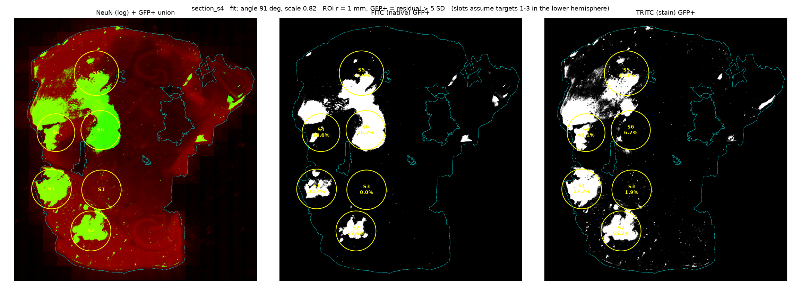

# Histology pipeline — GFP coverage per target

**Status:** first pass on Mouse_01 (2026-09-16); orientation, delivery channel and
focal-spot size confirmed by N. Todd on 2026-09-18; ROI radius moved to 1.0 mm and
Mouse_02 exported and measured on 2026-09-30. **Mouse_02 is not yet mapped to targets**
— see [Mouse_02](#mouse_02). Parameters still marked *provisional* have not been decided.

This is the ground-truth half of the project, implementing Phase 2 of
[`ground-truth-spec.md`](ground-truth-spec.md). It turns a whole-slide `.vsi` scan into
GFP area coverage for each of the six sonication targets, for every section. Code is in
[`src/fus/histology.py`](../src/fus/histology.py).

It measures area coverage (option A in
[decision 001](decisions/001-delivery-endpoint.md)). Everything up to the last step is
the same whichever endpoint is chosen.

---

## Run it

```bash
# 1. One OME-TIFF per section, 4x downsampled (1.3 µm/px). Needs QuPath 0.7;
#    set $QUPATH if it is not in /Applications. ~20 s per section.
PYTHONPATH=src python -m fus.histology export \
    data/histology/Mouse_01/Image.vsi data/processed/histology/Mouse_01/ds4

# 2. Coverage per slot, plus an overlay figure per section. ~11 s per section.
PYTHONPATH=src python -m fus.histology measure \
    data/processed/histology/Mouse_01/ds4/section_s*.ome.tif \
    --csv results/histology/mouse01_slots.csv --figures results/histology/figures

# Mouse_02 onwards: one .vsi per slide, whose series numbers repeat, so prefix them
for i in 1 2 3 4; do
  .venv/bin/python -m fus.histology export data/histology/Mouse_02/Control_02_Slide_0$i.vsi \
      data/processed/histology/Mouse_02/ds4 --prefix slide0$i
done
# ...click the front and notch of each section (see "Mouse_02" below), then measure
.venv/bin/python -m fus.orientation data/processed/histology/Mouse_02/ds4/*.ome.tif \
    data/processed/histology/Mouse_01/ds4/section_s*.ome.tif
.venv/bin/python -m fus.histology measure data/processed/histology/Mouse_02/ds4/*.ome.tif \
    --orientation data/section_orientation.csv \
    --csv results/histology/mouse02_template_slots.csv --figures results/histology/figures/mouse02_template
```

Geometry tests: `PYTHONPATH=src python -m pytest tests/`

---

## Geometry — two corrections to the spec

**`posx.xyz` is an axial layout.** The planning image in `Mouse_01_AAV_Images.pptx` is
the axial panel of a three-view MRI viewer, and the six circles fit `xyz` at the same
scale on both axes (271 k vs 288 k EMU/mm on the slide; every circle within 0.07 mm). So:

| Column | Meaning |
|---|---|
| `x` | medio-lateral — targets 1–3 on one side, 4–6 mirrored on the other |
| `y` | antero-posterior, +y anterior |
| `z` | depth — **0 for all six targets** |

Spec §3 reads `y` as dorsal/ventral, which is wrong. Targets 1/4 are the anterior pair,
2/5 the lateral pair, and 3/6 the posterior-medial pair, 0.5 mm behind 2/5.

**The Mouse_01 sections are horizontal, not coronal.** Every section contains both
hippocampi and the cerebellum. Anterior faces the image left. The targets share one
depth, so **a section at that depth crosses all six**, and no section has to be matched
to a target by AP position. (Spec §4 and the README banner caption say "coronal".)

**The image cannot tell the hemispheres apart.** The plan is mirror-symmetric (target
k ↔ k ± 3), and the sections were evidently mounted both ways up (see below). Results
are therefore reported per **slot**: the plan position *assuming targets 1–3 lie in the
image's lower hemisphere when anterior faces left*. `slot_to_target(slot, mirrored)`
converts a slot to a target once a section's orientation is known.

---

## Method

| Step | How | Parameter |
|---|---|---|
| Resolution | QuPath `convert-ome`, pyramid level 4× | 1.3 µm/px |
| Tissue mask | Otsu on log(CY5) + log(TRITC) at 5.2 µm/px. DAPI is not used because out-of-focus haze makes the glass beside some sections as bright as tissue | holes < 0.05 mm² filled; fragments < 0.5 mm² dropped |
| Background | Normalised Gaussian average of tissue, recomputed 3× with pixels above threshold excluded. Handles regional autofluorescence (s5 has two background levels) | σ = 1 mm *(provisional)* |
| GFP+ | residual > k × robust pixel-noise SD, per channel | k = 5, k ± 1 also reported *(provisional)* |
| Plan placement | Similarity fit (rotation, shift, shrinkage) of the six-point plan to the GFP+ density map, using both channels combined. Full search, then a **leave-one-out** refinement per target | scale 0.7–1.3 |
| ROI | Disc at each target's leave-one-out position | r = 1.0 mm × fitted scale — half the ~2 mm lateral focal spot (0.75 mm placeholder before 2026-09-30) |
| Measure | coverage = GFP+ tissue px / tissue px in ROI; mean background-subtracted intensity | both channels |

**Why leave-one-out.** Placing ROIs from the GFP itself would put each ROI on its own
plume and inflate its coverage. Instead, target k's ROI comes from a fit to the other
five, so its own signal plays no part in where it lands. An empty target is measured
where the rest of the pattern says it should be.

**Why not the no-FUS target as the threshold reference** (spec §8)? That site is also
the only check that the pipeline reads zero when nothing was delivered, and it can't do
both jobs. Whole-section robust statistics are used instead. Revisit once there is an
untreated animal or a second negative region.

---

## Mouse_01 results



Section s4. Left: NeuN (log) with the GFP+ union. Middle and right: GFP+ masks per
channel. Slot 3 reads 0.0 % (FITC) and 1.9 % (TRITC). Slot 6 is 76 % in FITC and 6.7 %
in TRITC — see known problem 1.

### Per section

| Section | Fit angle | Fit scale | Empty slot | Notes |
|---|---|---|---|---|
| s2 | 107° | 0.89 | 3 | |
| s3 | 217° | 0.70 | — | **Fit failed** (half a section; angle flagged, scale at bound). Excluded |
| s4 | 91° | 0.82 | 3 | |
| s5 | 79° | 0.91 | 6 | |
| s6 | 71° | 0.84 | 6 | |

Scale ≈ 0.8–0.9 is tissue shrinkage relative to the plan, which is plausible for fixed,
sectioned tissue.

### Orientation

The empty slot switches between 3 and 6, so the sections were not all mounted the same
way. To test this without the empty pair deciding its own label, each combination of
mirrorings was scored by how well sections agree on **targets 1, 2, 4, 5 only**. The best
is s2 and s4 as-is, s5 and s6 mirrored: mean between-section SD 0.10, against 0.12 for
the runner-up. Under that orientation the empty site is the **same target in all four
sections**. That agreement is independent evidence.

Which target it is — 3 or 6 — cannot be read off the image. **Confirmed:** position 3
was never sonicated, so the empty site is target 3. For future animals the notch (bottom
left) gives the orientation directly, without relying on an unsonicated target.

### Coverage by target (s2, s4, s5, s6)

| Target | Exposure | TRITC mean (range) | FITC mean (range) |
|---|---|---|---|
| 1 | 3 sonications, 420 bursts | 0.66 (0.46–0.75) | 0.29 (0.18–0.39) |
| 2 | 45 bursts, 1.05 | 0.48 (0.40–0.55) | 0.24 (0.19–0.28) |
| 3 | No FUS control | **0.02** (0.01–0.03) | **0.00** |
| 4 | 90 bursts, 0.95 | 0.48 (0.43–0.52) | 0.26 (0.16–0.41) |
| 5 | 60 bursts, 0.85 | 0.25 (0.00–0.33) | 0.27 (0.20–0.31) |
| 6 | 240 bursts, 0.55 | 0.18 (0.00–0.46) | 0.58 (0.11–0.76) |

ROI r = 1.0 mm. At the earlier 0.75 mm placeholder, TRITC read 0.82, 0.65, 0.02, 0.52,
0.31, 0.19 — same ranking.

**Not a dose-response.** This is one animal. The recording-to-position mapping is now
confirmed (see [mouse01-dose-delivery.md](mouse01-dose-delivery.md) step 3); Mouse 1 was
the one animal where the operator deviated from the plan.

---

How these numbers were joined to acoustic dose and plotted:
[mouse01-dose-delivery.md](mouse01-dose-delivery.md).

---

## Mouse_02

Arrived 2026-09-29: four slides (`Control_02_Slide_01–04.vsi`), three sections each, same
four channels at 0.325 µm/px as Mouse_01. Exported 2026-09-30. It is measured with a
template placed from clicks (below), and the output is `results/histology/mouse02_template_slots.csv`.

**Why it can't be run like Mouse_01.** Two things that anchored Mouse_01 are missing:

1. **The sections are mounted at any rotation**, and the six-target pattern nearly matches
   itself turned 180°. The anterior pair (1/4, y = 5) and the posterior pair (3/6,
   y = 2.5) swap to within ~0.5 mm. On Mouse_01 the 180° alternative scored 15–30 %
   below the best fit, and anterior-left was known anyway. On Mouse_02 it scores within
   12 % on 8 of 12 sections (within 10 % on 5), and **higher** on `slide02_s4`, where the global search
   missed it.
2. **Every target was sonicated**, so there is no empty site to fix left from right. The
   notch has to do that.

**How it's done now: a template placed from clicks.** In
[`notebooks/ingest_new_histology.ipynb`](../notebooks/ingest_new_histology.ipynb), a person
clicks three points on each section in napari
([`fus.orientation`](../src/fus/orientation.py)): the brain's **centre** on the midline,
its **front** tip, and a point out to the **side the notch is on**. The six-target plan
is then laid on the section as a rigid template, with no GFP fitting (`template_fit`):

| | From |
|---|---|
| Rotation | centre → front arrow |
| Position | the target centroid sits 1.9 plan mm (≈ 1.6 mm of tissue) in front of the centre click. Calibrated on Mouse_01's four good sections, where the fitted pattern sat 1.46–1.74 mm in front of the brain centre |
| Size | fixed shrinkage 0.87, the mean of Mouse_01's fits (0.82–0.91) |
| Mirroring | notch side. Mouse_01's notch clicks, with its orientation known from the empty target 3, put targets 1–3 on the animal's **right**; all four sections agree |

The template is drawn live while clicking, so a misplaced centre shows at once. A second
napari window shows the same template labelled T1–T6 with coverage, and records ✓/✗ per
section. Only ✓ sections are used.

**Finetuning (optional).** After orienting, each target can be moved, resized or rotated
on its own in napari (`fus.rois.finetune`). The shapes are saved per target in
[`data/roi_locations.csv`](../data/roi_locations.csv), and `analyse_section(..., rois=...)`
measures inside exactly those ellipses (`placement = finetuned`). Resizing changes the
measurement itself: coverage is a fraction *of the shape*. Placing shapes by eye on the GFP
can also pull a target onto its own signal. The benchmark scores finetuned Mouse_01 shapes
the same way as the template.

**Benchmark: `scripts/benchmark_mouse01.py`.** Mouse_01 is the answer key: an
unsonicated target, a known front direction, and a validated GFP fit. The script lays
the template from the Mouse_01 clicks on s2, s4, s5 and s6 and checks it against the fit
with fixed thresholds: control T3 ≤ 0.05; ROI offset median ≤ 0.5 mm and max ≤ 1.0 mm;
target means within 0.10; Spearman ≥ 0.9; mirroring reproduced. With the automatic
centres (2026-09-30) it passes the control and mirroring checks and fails the rest:
offset median 0.61 mm, max 1.08; largest target difference 0.14; ρ 0.83. Re-run it after
clicking the Mouse_01 centres by hand. Until it passes, Mouse_02 numbers from the template
are provisional.

**Re-scored with hand-finetuned shapes (2026-09-30)**, from `results/histology/mouse01_benchmark.csv`:
it passes 4 of 5 checks. Offset is a median 0.33 mm and a max 0.94 mm, ranking ρ is 0.94,
and the control and mirroring checks pass. It fails delivery on one target only: T4 reads
+0.14 against a tolerance of 0.10.

**Accuracy caveat.** On Mouse_01, the template placed from the *automatic* brain centroid
landed 0.1–1.1 mm from the validated GFP fit's ROI centres. That moved coverage by up to
0.3 (s2 T1: 0.46 → 0.18). Part of it is the centroid sitting 0.2–0.8 mm off the midline,
which a clicked centre fixes. How close clicked centres get has not been measured yet.
Mouse_01's reported numbers still use the leave-one-out GFP fit.

**Per-section picture from the unoriented run** (TRITC; fit angles are not trustworthy
until anterior is recorded):

| Section | Fit angle / scale | Max slot coverage | Note |
|---|---|---|---|
| slide01_s2 | 189° / 1.14 | 0.13 | little GFP; poor fit |
| slide01_s3 | 181° / 0.89 | 0.87 | |
| slide01_s4 | 322° / 0.89 | 0.25 | little GFP |
| slide02_s2 | 242° / 1.30 | 0.30 | scale at bound; one ROI 7 % tissue |
| slide02_s3 | 184° / 0.93 | 0.85 | |
| slide02_s4 | 12° / 0.82 | 0.83 | 180° alternative scores higher |
| slide03_s2 | 210° / 0.76 | 0.80 | one slot moved 1.6 mm leave-one-out |
| slide03_s3 | 34° / 0.70 | 0.80 | scale at bound |
| slide03_s4 | 37° / 0.93 | 0.51 | little GFP |
| slide04_s2 | 318° / 1.22 | 0.29 | little GFP; one ROI off tissue |
| slide04_s3 | 252° / 0.91 | 0.85 | |
| slide04_s4 | 190° / 0.79 | 0.54 | |

Several sections carry little GFP anywhere, and the first series on three slides is
among them. They are probably above or below the focal column, but section order and
depth are still unknown. N. Todd also reports **the head was rolled** in this animal
(right-side targets higher, left-side lower), so a single horizontal section cuts the
two sides at different depths. Coverage can differ between the sides of one section for
reasons that have nothing to do with dose.

A notch detector was tried and dropped. It measures the tissue missing from one side of
the fitted midline compared with the other. On Mouse_01 it finds 9–15 mm² missing on the
targets 1–3 side in all four good sections, consistent with the empty-target orientation.
But the deficit is centred mid-brain, not at a corner, so it may be section tilt rather
than the notch. On Mouse_02 the signal is weaker, and it depends on a fit that may be
turned 180°.

---

## Known problems

1. **FITC and TRITC disagree at target 6** (and at target 5 in s5). TRITC is the agreed
   delivery measure, so this affects the placement map rather than the numbers. The site
   is bright in native GFP and near background in the antibody channel. At full resolution in s4, the
   99th-percentile brightness is 21.9 k (FITC) against 1.7 k (TRITC); at target 1 TRITC
   reaches 22.8 k. FITC also marks a detached cerebellum fragment in s2 that TRITC does
   not, so FITC picks up at least some non-GFP signal. **Needs a look at full
   resolution:** s4 is series 4 of `Image.vsi`, and the site is centred near
   x = 11 070, y = 14 400 px.
   The combined map used for placement includes FITC, so in s5 this signal probably pulls
   slot 2 off target.
2. **Tile seams** are visible at full resolution and are not corrected.
3. **The tissue mask accepts bright non-tissue** — a strip beside s3 and an object in the
   corner of s5. It only matters if an ROI lands there.
4. **Placement depends on the other plumes.** If another target's plume sits off its
   planned spot, the whole pattern shifts. `loo_shift_mm` > ~0.5 flags this (s4 slot 5:
   0.76; s6 slot 2: 0.67).

## Output columns

| Column | Meaning |
|---|---|
| `section`, `slot`, `channel` | One row per section × slot × channel |
| `coverage`, `coverage_k-1`, `coverage_k+1` | GFP+ fraction of tissue in the ROI at k and k ± 1 |
| `mean_residual` | Background-subtracted intensity per tissue pixel |
| `tissue_fraction` | Share of the ROI that is tissue — low means a tear or the section edge |
| `loo_shift_mm` | How far the ROI moved when its own target was left out of the fit |
| `fit_angle_deg`, `fit_scale` | That slot's leave-one-out transform |
| `angle_flag` | Full fit more than 30° from anterior-left — treat the section as failed |
| `row`, `col`, `radius_px`, `noise_sd`, `threshold_k` | Provenance, in 4× export pixels |

## Answered on 2026-09-18 (N. Todd)

1. **Which image side is the animal's right?** Sections carry a **notch** — bottom right
   on Mouse 1, bottom left for animals from here on. Mouse 1 also has the unsonicated
   target 3 as a second cue. Sections were indeed mounted both ways up.
2. **FITC vs TRITC** — use the **GFP stain (TRITC)** as the delivery measure. What the
   FITC-only signal at target 6 is remains open.
3. **ROI radius** — the focal spot is **~2 × 2 mm in x/y and ~3 mm in z**, so the radius
   is now **1.0 mm** (re-run 2026-09-30); precise dimensions to follow.
4. **Recording → target** — `TargetN` was fired at position N for every animal except
   Mouse 1; see [mouse01-dose-delivery.md](mouse01-dose-delivery.md) step 3.

## Still open

1. **Section order and depth** — series 2–6 need not be in depth order, the spacing is
   unknown, and which sections fall inside the 3 mm focal column is therefore unknown.
2. **What the FITC-only signal is** at target 6 (autofluorescence, blood, or failed
   staining).
3. **Imaging settings** — whether exposure is held fixed across sessions, which any
   intensity comparison between animals depends on.
