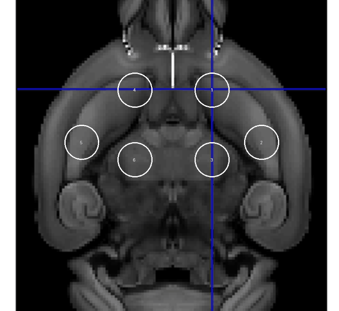
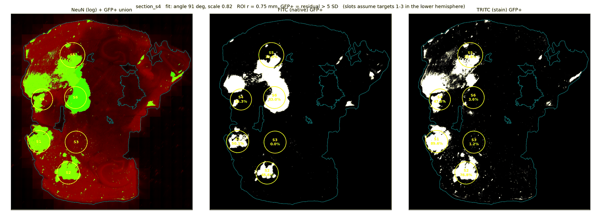
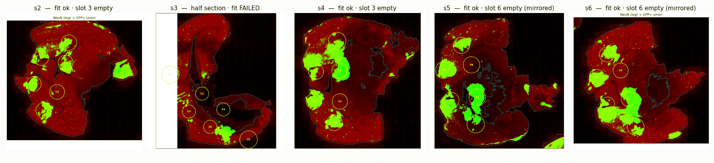
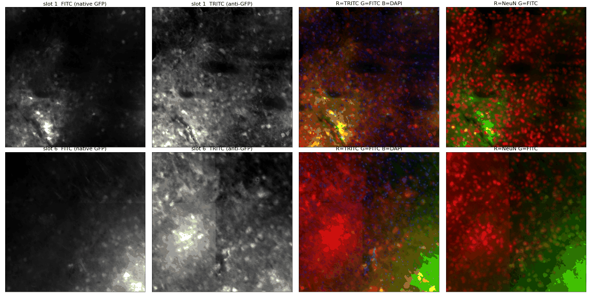
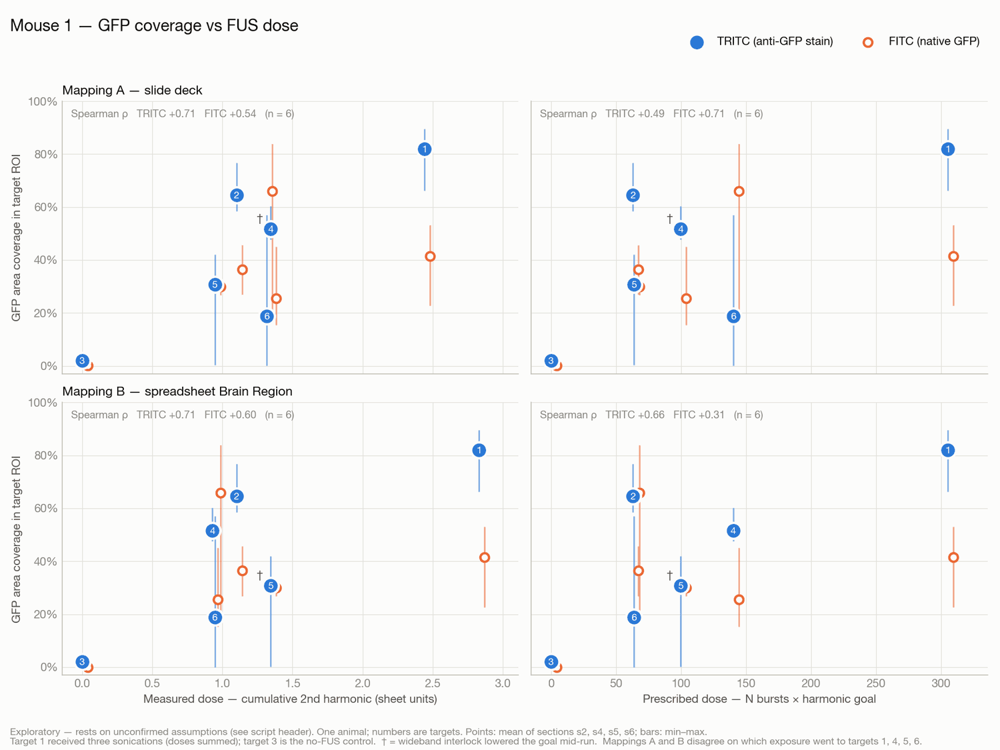

# Mouse 1 — how the dose vs delivery plots were made

**Status:** exploratory, 2026-09-16. One animal. Several steps rest on assumptions that
haven't been confirmed with Nick or Bernie. Each one is marked **[A#]** and collected in
[Assumptions](#assumptions).

This document follows the chain from raw files to the two plots below: acoustic dose per
target on one side, measured AAV delivery per target on the other, then joined and
plotted.

---

## Contents

- [The result](#the-result)
- [Pipeline at a glance](#pipeline-at-a-glance)
- [Step 1 — acoustic dose per recording](#step-1--acoustic-dose-per-recording)
- [Step 2 — AAV delivery per target](#step-2--aav-delivery-per-target)
- [Step 3 — joining dose to delivery](#step-3--joining-dose-to-delivery)
- [Step 4 — the plots](#step-4--the-plots)
- [Assumptions](#assumptions)
- [What this does and doesn't show](#what-this-does-and-doesnt-show)
- [Reproduce](#reproduce)

---

## The result


| | Value |
|---|---|
| Pearson r (6 targets) | **0.83** (p = 0.04) |
| Spearman ρ (6 targets) | 0.71 (p = 0.11) |
| Pearson r without the no-FUS control (5 targets) | 0.67 (p = 0.21) |
| Pearson r, single-sonication targets only (2, 4, 5, 6) | **−0.06** (p = 0.94) |
| Least-squares fit | coverage = 0.043 + 0.314 × dose, R² = 0.68 |

**Two points produce almost all of the correlation:** the no-FUS control at (0, 0) and
target 1, which got three sonications. Among the four targets that got one sonication
each, delivery does not rise with dose. See
[What this does and doesn't show](#what-this-does-and-doesnt-show).

---

## Pipeline at a glance

```
 Acoustic side                                 Tissue side
 ─────────────                                 ───────────
 Mouse_Cntr_01_Target*.mat  (7 files)          Mouse_01/Image.vsi  (5 sections)
        │                                             │
        │ fus.extract                                  │ QuPath convert-ome (4x)
        ▼                                             ▼
 cumulative 2nd harmonic                       tissue mask · background removal
 per recording                                 GFP+ threshold · target circles
        │                                             │
        │                                             ▼
        │                                      coverage per slot, per section
        │                                             │ orientation [A1, A2]
        │                                             ▼
        │                                      coverage per target (mean of 4 sections)
        │                                             │
        └──────────────┬──────────────────────────────┘
                       │ recording → target mapping  [A4, A5, A6]
                       ▼
          one row per target: dose, delivery
                       │
                       ▼
          scripts/mouse01_dose_vs_coverage.py → the plots
```

| Input | What it provides |
|---|---|
| `data/acoustic/20260611/Mouse_Cntr_01_Target*.mat` | Per-burst emission spectra and controller state for each sonication |
| `data/histology/Mouse_01/Image.vsi` | Whole-slide fluorescence scan: 5 sections, 4 channels, 0.325 µm/px |
| `data/histology/Mouse_01_AAV_Images.pptx` | The lab's target diagram, plus burst count and goal written next to each target position |
| `data/Mouse_Controller_Data.xlsx` | Per-sonication summary, including a `Brain Region` column |

---

## Step 1 — acoustic dose per recording

Each `.mat` file goes through [`fus.extract`](../src/fus/extract.py), the Python port of
the lab's `nt_ExtractHarmonicData.m` (see [acoustic-extraction.md](acoustic-extraction.md)).
Per burst, it measures the peak and area of the second-harmonic signal at 1.674 MHz,
divides by the pre-microbubble baseline, and sums over the run.

Two dose measures come out of this:

- **Measured dose:** cumulative 2nd-harmonic area in spreadsheet units (÷ 10⁴). This
  matches the `Cumulative 2nd Harmonic` column of the spreadsheet exactly for every
  Mouse 1 file.
- **Prescribed dose:** stored bursts × harmonic goal, which is how the README defines
  the controller's dose.

| Recording | Programmed bursts | Stored bursts | Goal | Measured dose | Interlock fired |
|---|---|---|---|---|---|
| Target1 | 120 | 135 | 0.75 | 0.9462 | |
| Target2 | 60 | 75 | 0.85 | 0.5658 | |
| Target2_Repeat | 45 | 60 | 1.05 | 1.1015 | |
| Target3 | 240 | 255 | 0.55 | 0.9293 | |
| Target4 | 90 | 105 | 0.95 | 1.3457 | yes |
| Target5 | 60 | 75 | 0.85 | 0.9466 | |
| Target6 | 240 | 255 | 0.55 | 1.3164 | |

"Interlock fired" means the wideband safety cutoff lowered the harmonic goal partway
through the run, so Target4 got less than its prescribed exposure.

---

## Step 2 — AAV delivery per target

Full method and parameters: [histology-pipeline.md](histology-pipeline.md). Code:
[`src/fus/histology.py`](../src/fus/histology.py).

### 2a. Export

QuPath 0.7 writes each section of the `.vsi` as an OME-TIFF at 4× reduced resolution
(1.3 µm/px), about 20 s per section.

### 2b. Geometry: where the targets are

Every recording stores the same six-target plan (`posx.xyz`, in mm). The deck draws it
on the axial panel of the lab's MRI planning viewer:



*The circles and numbers are placed from the positions of the shapes on slide 2 of
`Mouse_01_AAV_Images.pptx`.*

The circle positions match the plan table at one common scale on both axes, to within
0.07 mm. So `x` is left–right, `y` is front–back (front at the top), and all six
targets are at the same depth (z = 0).

The Mouse_01 sections are **horizontal**: each contains both hippocampi and the
cerebellum, with the front of the brain toward the image left. A section at the target
depth therefore crosses all six targets.

### 2c. Measuring GFP

For each section:

1. **Tissue mask.** Otsu threshold on log(CY5) + log(TRITC). DAPI is not used because
   haze makes the glass beside some sections as bright as tissue.
2. **Background removal.** A smooth local background (σ = 1 mm, with bright spots left
   out of the estimate) is subtracted from each GFP channel, because background
   brightness differs between brain regions.
3. **GFP+ pixels.** Background-subtracted signal above 5× the pixel noise SD.
   Coverage is also computed at 4× and 6× as a sensitivity check.

### 2d. Placing a circle on each target

The six targets form a fixed pattern, so the code fits that pattern (rotation, position,
shrinkage) to the GFP spots. **Each target's circle comes from a fit to the other five
targets**, so a target's own GFP cannot pull its circle onto itself. An empty target is
then measured where the rest of the pattern says it should be. Each circle has a
radius of 0.75 mm, scaled by the fitted shrinkage.

Coverage is the fraction of tissue pixels inside the circle that are GFP+.



### 2e. All five sections



- **s3** is only half a section. Its fit landed at 217° with shrinkage at the lower
  limit, the angle check flagged it, and it is **excluded**.
- **Fitted shrinkage** in the other four sections is 0.82–0.91 of the plan: the tissue
  shrank during processing.

### 2f. Which side is which [A1, A2]

The target pattern is left–right symmetric (target k mirrors k ± 3), so the image can't
tell which hemisphere holds targets 1–3. The code therefore reports **slots**: plan
positions under the assumption that targets 1–3 are in the image's lower hemisphere.

The empty spot is slot 3 in s2 and s4 but slot 6 in s5 and s6, so the sections were
mounted in different orientations. Every combination of mirrored and unmirrored
sections was scored on how well the sections agree about **targets 1, 2, 4 and 5 only**,
so the empty pair did not influence the choice.

- **Best combination [A1]:** s2 and s4 as scanned, s5 and s6 mirrored. Mean
  between-section SD 0.10, against 0.14 for the next best.
- **Independent check:** under that choice, the empty spot is the same target in all four
  sections.
- **Remaining ambiguity [A2]:** whether that spot is target 3 or target 6 depends on an
  overall left–right flip that the image can't settle. It is taken to be target 3,
  which the deck labels "No FUS control".

Coverage per target is then the mean of the four sections, with the min–max range
shown as bars **[A3]**.

### 2g. Which GFP channel [A7]

The scan has native GFP (FITC) and an anti-GFP antibody stain (TRITC). They disagree
sharply at target 6:



- **Target 1 (top row):** strong in both channels.
- **Target 6 (bottom row):** bright in FITC (99th percentile about 21,900 counts) but near
  background in TRITC (about 1,700). Each panel is contrast-stretched separately, so the
  TRITC panel looks brighter than it is.
- **FITC off-target signal:** FITC also marks a detached cerebellum fragment in s2 that
  TRITC does not, so FITC picks up some signal that isn't GFP.

The scatter therefore uses **TRITC**. Both channels are shown in the four-panel figure.

| Target | TRITC coverage (range) | FITC coverage (range) |
|---|---|---|
| 1 | 0.82 (0.66–0.90) | 0.41 (0.23–0.53) |
| 2 | 0.65 (0.59–0.77) | 0.36 (0.27–0.46) |
| 3 | 0.02 (0.01–0.05) | 0.00 |
| 4 | 0.52 (0.48–0.60) | 0.26 (0.15–0.45) |
| 5 | 0.31 (0.00–0.42) | 0.30 (0.27–0.32) |
| 6 | 0.19 (0.00–0.57) | 0.66 (0.17–0.84) |

---

## Step 3 — joining dose to delivery

This is the least certain step. The files, the deck and the spreadsheet don't agree on
which recording went to which target position:

- **The deck** gives position 1 as "420 bursts" and position 3 as "No FUS control".
- **The spreadsheet's `Brain Region` column** puts **three** recordings at position 1,
  none at position 3, and orders positions 4–6 differently from the deck.

Two mappings were built **[A4]**:

| Target | Mapping A — slide deck | Mapping B — spreadsheet |
|---|---|---|
| 1 | Target1 + Target2 + **Target3** | Target1 + Target2 + **Target6** |
| 2 | Target2_Repeat | Target2_Repeat |
| 3 | none (no FUS) | none (no FUS) |
| 4 | Target4 | Target3 |
| 5 | Target5 | Target4 |
| 6 | Target6 | Target5 |

- **Why Target3 goes to position 1 in mapping A:** 120 + 60 + 240 programmed bursts =
  the deck's "420". Target6 (also 240 bursts at 0.55) is needed at position 6, which
  leaves Target3, the other 240-burst file.
- **Repeat sonications add up [A5]:** target 1's dose is the sum of its three
  recordings.
- **No FUS means zero dose [A6]:** the control target is plotted at 0.

| Target | A: measured dose | A: prescribed dose | B: measured dose | B: prescribed dose |
|---|---|---|---|---|
| 1 | 2.441 | 305.25 | 2.828 | 305.25 |
| 2 | 1.101 | 63.00 | 1.101 | 63.00 |
| 3 | 0 | 0 | 0 | 0 |
| 4 | 1.346 | 99.75 | 0.929 | 140.25 |
| 5 | 0.947 | 63.75 | 1.346 | 99.75 |
| 6 | 1.316 | 140.25 | 0.947 | 63.75 |

---

## Step 4 — the plots

Both plots come from
[`scripts/mouse01_dose_vs_coverage.py`](../scripts/mouse01_dose_vs_coverage.py), which
also writes the joined table to `results/histology/mouse01_dose_vs_coverage.csv`.

### All combinations



- **Rows** are the two mappings; **columns** are measured and prescribed dose.
- **Markers:** filled blue = TRITC (number = target), hollow orange = FITC for the same
  target, drawn 10 px to the right so the two don't overlap.
- **Bars** span the min–max across the four sections.
- **†** marks the recording where the safety cutoff fired.
- Each panel shows Spearman ρ for both channels.

This figure shows how much the picture depends on the assumptions. Switching mappings
moves four of the six points along the dose axis, and switching channels reorders the
targets.

### The single correlation

The scatter at the top uses **mapping A, measured dose and TRITC**:

- **Large dots:** target means, with the target number inside.
- **Small dots:** each section's individual value.
- **Line:** ordinary least squares on the six target means.
- **Shaded band:** 95% confidence interval for the fitted mean
  (t distribution, 4 degrees of freedom).
- **Statistics:** `scipy.stats.pearsonr` and `spearmanr` on the six target means.
  Individual sections are not treated as independent points.

Colors follow the project's dataviz palette. TRITC and FITC are also told apart by
filled vs. hollow markers.

---

## Assumptions

| # | Assumption | Basis | If wrong |
|---|---|---|---|
| A1 | s2 and s4 as scanned; s5 and s6 mirrored | Best between-section agreement on targets 1, 2, 4, 5 (SD 0.10 vs 0.14) | Coverage values get swapped between mirror pairs (1↔4, 2↔5, 3↔6) in some sections |
| A2 | The empty spot is target 3 | Deck: "No FUS control" at position 3 | All labels mirror: 1↔4, 2↔5, 3↔6 |
| A3 | Target coverage = mean of s2, s4, s5, s6 | The only four sections with a good fit | Depends on section depth, which is unknown |
| A4 | Recording → target: mapping A (scatter) or B (grid) | Deck labels and burst totals / spreadsheet `Brain Region` | Four of six points move along the dose axis |
| A5 | Doses from repeat sonications at one target add | Simplest model | Target 1's dose would be overstated if only its last run mattered |
| A6 | The no-FUS control has zero dose | By definition | — |
| A7 | TRITC is the delivery measure | FITC shows signal that isn't GFP | Target 6 moves from lowest delivery (after the control) to highest |
| — | Circle radius 0.75 mm, threshold 5 SD, background σ 1 mm | Chosen before any coverage was computed | Threshold: coverage shifts by up to 5 percentage points at 4 or 6 SD, and the target ranking is identical in both channels. Radius and σ have not been tested at other values |

---

## What this does and doesn't show

**It shows the pipeline works end to end.** A `.vsi` scan and seven `.mat` recordings go
in, and one row per target comes out, with dose and delivery side by side. The
no-FUS control reads near zero in both GFP channels, which is the pipeline's most
basic sanity check.

**It does not show a dose–response relationship:**

- **Leverage:** r = 0.83 comes mostly from two high-leverage points. One is the control,
  which confirms FUS is needed at all. The other is target 1, whose dose is a sum of
  three runs under assumption A5. Across the four single-sonication targets, r = −0.06.
- **Sample size:** n = 6 targets from one animal, with no replication across animals.
- **Label uncertainty:** which recording went to which target is uncertain (A4), and the
  two mappings disagree on four of the six doses.
- **Channel choice:** the delivery measure depends on it (A7), and the two channels
  disagree at one of six targets.

The p-value in the scatter should not be quoted as a result.

**What would firm it up:**

1. Nick confirming which recordings went to which target position.
2. Bernie confirming which image side is the animal's right, and whether the FITC-only
   signal at target 6 is real GFP.
3. More animals. Each imaged animal adds up to six targets, and within-animal
   comparisons (same skull, different exposures) are the strongest design here.

---

## Reproduce

```bash
# acoustic side needs nothing beyond the .mat files
# tissue side: export sections (QuPath 0.7), then measure
PYTHONPATH=src python -m fus.histology export \
    data/histology/Mouse_01/Image.vsi data/processed/histology/Mouse_01/ds4
PYTHONPATH=src python -m fus.histology measure \
    data/processed/histology/Mouse_01/ds4/section_s*.ome.tif \
    --csv results/histology/mouse01_slots.csv --figures results/histology/figures

# join and plot (assumptions live at the top of this script)
PYTHONPATH=src python scripts/mouse01_dose_vs_coverage.py
```

Outputs go to `results/histology/`. The figures in this document are copies saved in
`docs/figures/`, because PNGs under `results/` are git-ignored.
